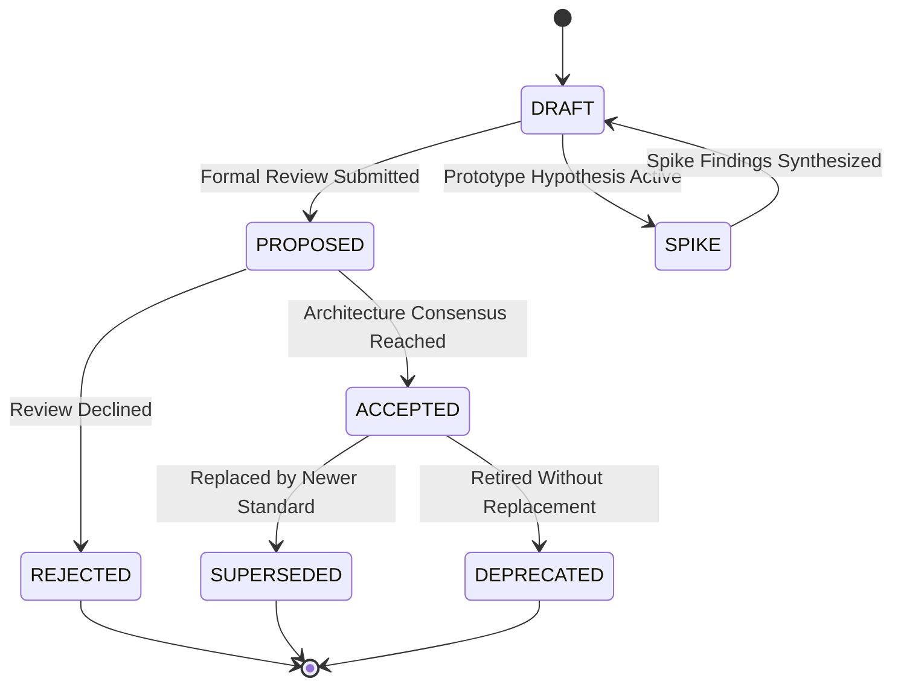
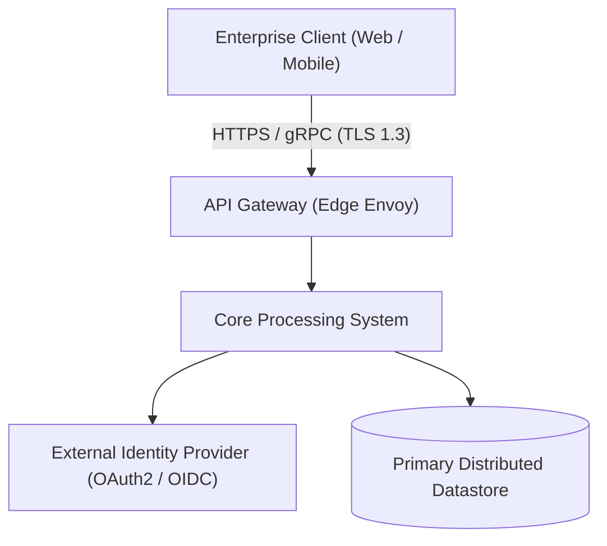
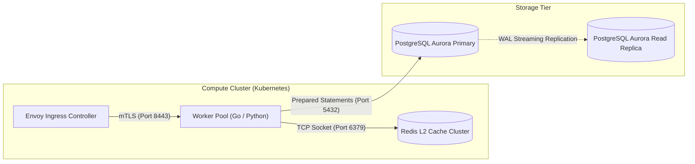

# Enterprise Technical Documentation Structural Specification (v2.0)

> [!NOTE]
> ### Structural Governance & CI Validation
> This specification defines mandatory structural schemas, lifecycle states, architectural modeling conventions, and template archetypes for all formal documentation.
> - **CI Validation**: `python scripts/validate_doc_frontmatter.py`
> - **Diagram Linting**: `npx @mermaid-js/mermaid-cli -i <file> -o /dev/null`
> - **Agent Manifest Isolation**: AI agent system prompts and skills in `.agents/` are strictly excluded from this standard.

---

## 1. Document Lifecycle & Provenance Frontmatter

Every formal technical document must begin with an unambiguous YAML frontmatter block declaring its provenance, ownership, and lifecycle state:

```yaml
---
id: "ADR-20260906-consensus-migration" # Canonical Slug: <TYPE>-YYYYMMDD-<kebab-name>
title: "Distributed Consensus Engine Migration"
status: "PROPOSED" # Allowed: DRAFT | PROPOSED | SPIKE | ACCEPTED | SUPERSEDED | DEPRECATED
owner: "platform-architecture-team"
last_reviewed: "2026-09-06"
supersedes: "ADR-20240115-raft-cluster" # Optional: ID of predecessor document
superseded_by: null # Populated atomically when replaced by a successor
dependencies: ["RFC-20251102-grpc-envelope"]
---
```

### 1.1 Lifecycle State Transitions



- **`DRAFT`**: Work in progress. Open for exploratory brainstorming and collaborative authoring.
- **`SPIKE`**: Active prototype exploration. Code experimentation and throwaway sandbox spikes are permitted to prove or falsify technical assumptions.
- **`PROPOSED`**: Formally submitted for engineering review. Production implementation must not proceed until consensus is reached.
- **`ACCEPTED`**: Authoritative consensus reached. Active specification binding production implementation.
- **`SUPERSEDED`**: Replaced by a successor. Any PR promoting a new document to `ACCEPTED` with `supersedes: ["OLD-ID"]` must atomically update the predecessor's status to `SUPERSEDED` and populate `superseded_by`.
- **`DEPRECATED`**: Obsolete without direct successor. Retained purely for historical forensic audit.

---

## 2. Architectural Modeling: C4 & Specialized Topologies

Architectural designs must utilize standard, structured diagrams rendered via fenced `mermaid` code blocks. To prevent rendering failures, all node labels with spaces, brackets, or slashes must be wrapped in double quotes.

### 2.1 Level 1: System Context Diagram
Establishes system boundaries, external actors, and third-party dependencies:



### 2.2 Level 2: Container & Infrastructure Topology
Maps deployable containers, network boundaries, and storage replicas:



### 2.3 Dynamic Diagrams: Protocol Choreography & Distributed State
Mandatory for multi-step transactions, retry loops, and failover workflows:

```mermaid
sequenceDiagram
    autonumber
    actor Client as Enterprise Client
    participant GW as API Gateway [Edge]
    participant Svc as Core Processing Engine
    participant DB as PostgreSQL Aurora Primary

    Client->>+GW: POST /api/v1/orders (Idempotency-Key)
    GW->>+Svc: Forward authenticated request (mTLS)
    Svc->>+DB: BEGIN; SELECT FOR UPDATE; COMMIT;
    alt Commit Succeeded
        DB-->>-Svc: 200 OK (Transaction Committed)
        Svc-->>-GW: 200 OK (Order Placed)
        GW-->>-Client: 200 OK
    else Lock Contention / Timeout
        DB-->>Svc: 40001 Serialization Failure
        Svc-->>GW: 503 Service Unavailable (Retry-After: 1s)
        GW-->>Client: 503 Service Unavailable
    end
```

---

## 3. Contiguous NFR Operational State Matrix

All Architecture Blueprints and RFCs must define explicit, contiguous, and non-overlapping operational thresholds using plain-text ASCII formatting (no broken LaTeX math):

| Dimension | Nominal State (Green) | Degraded State (Yellow) | Critical State (Red) | Automated Fallback / Mitigation Strategy |
| :--- | :--- | :--- | :--- | :--- |
| **Throughput** | `1,000 <= QPS <= 5,000` | `5,001 <= QPS <= 8,000` | `QPS > 8,000` OR `QPS < 200` | Shed excess via HTTP 429; alert on-call if traffic drops < 200 QPS |
| **P99 Latency** | `P99 <= 20ms` | `20ms < P99 <= 50ms` | `P99 > 50ms` | Serve stale reads from local L2 Redis cache (TTL: 120s) |
| **Availability** | `Uptime >= 99.95%` | `99.90% <= Uptime < 99.95%` | `Uptime < 99.90%` | Automated multi-AZ failover; route traffic to healthy region |
| **Durability (RPO)** | `RPO == 0` (Zero loss) | `0s < RPO <= 1s` | `RPO > 1s` | Block uncommitted ACKs; enforce synchronous WAL fsync |
| **Recovery (RTO)** | `RTO <= 30s` | `30s < RTO <= 60s` | `RTO > 60s` | Automated leader election via Raft quorum; notify incident bridge |

---

## 4. NASA Verification Matrix (V-Matrix Taxonomy)

Requirements must be mapped to the four canonical NASA verification methods (**NASA SP-2016-6105 Rev 2**):
1. **Test (T)**: Automated execution against test suites, stress benchmarks, or chaos tests.
2. **Analysis (A)**: Theoretical modeling, static code analysis (AST/Flake8/SonarQube), or automated secret scanning.
3. **Inspection (I)**: Visual human verification of code, documentation, or physical hardware without tool execution.
4. **Demonstration (D)**: Live staging walkthrough of functional user flows.

| Req ID | Requirement Statement | Method | Success Verification Criteria |
| :--- | :--- | :---: | :--- |
| `[REQ-01]` | Gateway **SHALL** rate-limit clients exceeding 100 req/sec. | **Test** | Load test verifies HTTP 429 is emitted at the 101st request. |
| `[REQ-02]` | Memory leak **SHALL NOT** exceed 1MB per 1M processed events. | **Analysis** | Heap memory profiling over 24-hour continuous endurance run. |
| `[REQ-03]` | Encryption keys **SHALL NOT** reside in unencrypted repositories. | **Analysis** | Automated static scanner (TruffleHog / GitGuardian) passes with 0 hits. |
| `[REQ-04]` | Disaster recovery runbook **SHALL** be verified quarterly. | **Demonstration** | Live failover walkthrough conducted on staging environment with sign-off. |

---

## 5. Copy-Pasteable Markdown Starter Templates

### 5.1 Archetype 1: Architecture Decision Record (ADR)

````markdown
---
id: "ADR-{{YYYYMMDD}}-{{KEBAB_TITLE}}"
title: "{{TITLE}}"
status: "PROPOSED"
owner: "{{TEAM_OR_INDIVIDUAL}}"
last_reviewed: "{{YYYY-MM-DD}}"
supersedes: null
superseded_by: null
dependencies: []
---

# {{ID}}: {{TITLE}}

## 1. Executive Summary
{{Two concise sentences summarizing the decision and primary impact.}}

## 2. Context & Problem Statement
{{Describe the business context, technical driver, and existing architectural bottleneck.}}

## 3. Considered Alternatives & Trade-Off Matrix

| Evaluation Dimension | Option A: {{NAME}} (Selected) | Option B: {{NAME}} | Option C: {{NAME}} |
| :--- | :--- | :--- | :--- |
| **Implementation Complexity** | Low / Medium / High | Low / Medium / High | Low / Medium / High |
| **Operational & Maintenance Cost**| Low / Medium / High | Low / Medium / High | Low / Medium / High |
| **P99 Latency Impact** | Neutral / +5ms / -10ms | Neutral / +15ms / -5ms | Neutral / +2ms / -12ms |
| **Team Delivery Velocity** | High (familiar stack) | Low (steep learning curve)| Medium |

## 4. Decision Outcome
Chosen Option: **Option A** because {{RATIONALE}}.

## 5. Consequences & Impact Matrix
- **Positive Impacts (+)**: {{Bullet list of tangible gains}}
- **Negative Impacts / Operational Tax (-)**: {{Bullet list of drawbacks and added burdens}}
- **Neutral Consequences (~)**: {{Side effects that do not harm or improve posture}}
````

### 5.2 Archetype 2: Operational Runbook (SEV Mitigation)

````markdown
---
id: "RUNBOOK-{{YYYYMMDD}}-{{INCIDENT_TOPIC}}"
title: "{{SERVICE_NAME}} - {{INCIDENT_REMEDIATION_TITLE}}"
status: "ACCEPTED"
owner: "{{ONCALL_TEAM}}"
last_reviewed: "{{YYYY-MM-DD}}"
---

# {{SERVICE_NAME}}: {{INCIDENT_REMEDIATION_TITLE}}

> [!CAUTION]
> **Blast Radius**: {{IMPACTED_SERVICES_AND_AZS}} | **Customer Traffic Impact**: {{DROPPED_REQUESTS_YES_NO}} | **Expected Downtime**: {{ESTIMATED_MINUTES}}m

## 1. Emergency Triage Fast-Path (< 30 Seconds)
- **Live Health Dashboard**: [Grafana / Datadog](https://monitoring.internal/d/{{DASHBOARD_ID}})
- **Primary Alert Rule**: `{{ALERT_RULE_NAME}}`
- **On-Call Contact**: Slack `#incident-response` | PagerDuty: `{{PAGERDUTY_SERVICE_KEY}}`
- **Emergency Kill-Switch / Immediate Rollback**:
  ```bash
  python scripts/emergency_kill_switch.py --target {{SERVICE_NAME}} --force
  ```

## 2. Containment & Diagnostic Verification
```bash
# Diagnostic: Confirm connection pool exhaustion
kubectl exec -it deploy/{{SERVICE_NAME}} -n prod -- netstat -an | grep ESTABLISHED | wc -l
# Expected Threshold: > 900 indicates active pool saturation
```

## 3. Step-by-Step Remediation Procedure

### Step 1: Drain Saturated Worker Nodes
> [!WARNING]
> **Blast Radius**: Evicts all running pods on {{NODE_ID}}. In-flight requests receive SIGTERM.

**Execution Command**:
```bash
kubectl drain node-{{NODE_ID}} --ignore-daemonsets --delete-emptydir-data --force
```
**Verification Command**:
```bash
kubectl get nodes node-{{NODE_ID}} -o jsonpath='{.status.conditions[?(@.type=="Ready")].status}'
# Expected Output: SchedulingDisabled
```

## 4. Deterministic Rollback Procedure
If verification fails or error rate exceeds 5% for > 60s, abort remediation immediately:
```bash
kubectl uncordon node-{{NODE_ID}}
kubectl rollout undo deployment/{{SERVICE_NAME}} -n prod
```
````

---

## 6. Automated Frontmatter Validation Script (`scripts/validate_doc_frontmatter.py`)

All documentation pull requests must pass the automated CI frontmatter verification gate:

```python
#!/usr/bin/env python3
"""Deterministic Frontmatter & Provenance Validator."""
import glob, sys, yaml, re

FRONTMATTER_PATTERN = re.compile(r"^---\s*\n(.*?)\n---\s*\n", re.DOTALL)
VALID_STATUSES = {"DRAFT", "PROPOSED", "SPIKE", "ACCEPTED", "SUPERSEDED", "DEPRECATED"}
REQUIRED_FIELDS = {"id", "title", "status", "owner", "last_reviewed"}

EXCLUDE_PATTERNS = [".agents/**", "vendor/**", "*.generated.md"]
target_files = []

for pattern in ["docs/**/*.md", "specs/**/*.md", "architecture/**/*.md", "rfc/**/*.md"]:
    for filepath in glob.glob(pattern, recursive=True):
        if not any(re.search(ex.replace("**", ".*"), filepath) for ex in EXCLUDE_PATTERNS):
            target_files.append(filepath)

errors = []
for filepath in target_files:
    with open(filepath, "r", encoding="utf-8") as f:
        content = f.read()
    match = FRONTMATTER_PATTERN.match(content)
    if not match:
        errors.append(f"FAIL: {filepath} missing YAML frontmatter block '---'")
        continue
    try:
        meta = yaml.safe_load(match.group(1)) or {}
        missing = REQUIRED_FIELDS - set(meta.keys())
        if missing:
            errors.append(f"FAIL: {filepath} missing required fields: {sorted(missing)}")
        if meta.get("status") not in VALID_STATUSES:
            errors.append(f"FAIL: {filepath} invalid status '{meta.get('status')}'. Allowed: {sorted(VALID_STATUSES)}")
        if meta.get("status") == "SUPERSEDED" and not meta.get("superseded_by"):
            errors.append(f"FAIL: {filepath} marked SUPERSEDED but lacks 'superseded_by' target ID")
    except Exception as exc:
        errors.append(f"FAIL: {filepath} YAML syntax parse error: {exc}")

if errors:
    print(f"Schema Validation Failed with {len(errors)} error(s):\n" + "\n".join(errors), file=sys.stderr)
    sys.exit(1)

print(f"SUCCESS: Validated {len(target_files)} documents against provenance standard.")
sys.exit(0)
```