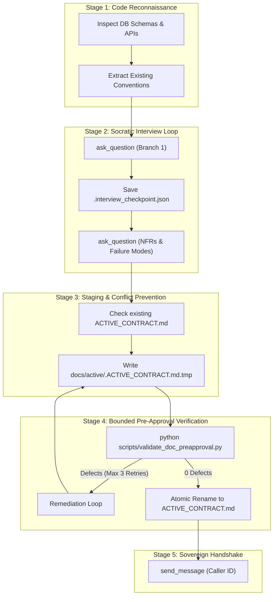

# Socratic Requirements Interview & Active Contract Protocol (v1.1)

A deterministic, high-rigor engineering runbook that delegates deep Socratic requirement interrogation to the specialized `socratic-interviewer` subagent via `invoke_subagent`, maintaining absolute context cleanliness for the primary orchestrator while producing a binding active engineering contract (`docs/active/ACTIVE_CONTRACT.md`).

---

## 1. Dedicated Socratic Interviewer Subagent Dispatch Protocol

When an interactive design interview or `/grill-me` session is requested, the primary orchestrator SHALL dispatch the `socratic-interviewer` subagent within the shared workspace (`Workspace: 'inherit'`):

> [!IMPORTANT]
> **Orchestrator Context Isolation Invariant**: The orchestrator SHALL NOT conduct the multi-turn question-and-answer loop directly in its main context window. Delegating the interview to `socratic-interviewer` keeps the orchestrator's attention focused on sprint state management, quality gate governance, and promotion execution.

### Dispatch Payload Template

```json
{
  "Subagents": [
    {
      "TypeName": "socratic-interviewer",
      "Role": "Socratic Requirements Architect",
      "Model": "inherit",
      "Workspace": "inherit",
      "Prompt": "Perform deep Socratic requirement interrogation for: <TOPIC_OR_TASK_NAME>.\nTarget Contract: docs/active/ACTIVE_CONTRACT.md.\n--caller-id: <CALLER_CONVERSATION_ID>\n\nExecution Bounds & Protocol:\n1. Inspect existing codebase conventions, schemas, and configurations using view_file and grep_search before asking questions.\n2. Traverse the architectural decision tree one branch at a time using ask_question, persisting each intermediate turn to docs/active/.interview_checkpoint.json.\n3. Verify collision status: if docs/active/ACTIVE_CONTRACT.md exists and status is ACCEPTED, archive it to docs/archived/CONTRACT-<timestamp>-<id>.md.\n4. Stage the binding contract strictly at docs/active/.ACTIVE_CONTRACT.md.tmp with status: \"PROPOSED\" conforming to the NASA Normative Lexicon (SHALL, SHALL NOT, MUST).\n5. Execute Pre-Approval Lint Gate: run 'python scripts/validate_doc_preapproval.py docs/active/.ACTIVE_CONTRACT.md.tmp' (max 3 remediation attempts) and ensure 0 defects.\n6. Upon 0-defect clearance, atomically promote staging file to docs/active/ACTIVE_CONTRACT.md and notify orchestrator via send_message(Recipient='<CALLER_CONVERSATION_ID>', Message='[CONTRACT_PROPOSED] path=docs/active/ACTIVE_CONTRACT.md status=PROPOSED defects=0 task_id=<target_task_id>') before completing your turn."
    }
  ]
}
```

---

## 2. 5-Stage Socratic Elicitation Workflow



### Stage 1: Pre-Emptive Codebase Reconnaissance
Before querying the human operator, the subagent MUST inspect relevant source files and configurations to eliminate redundant or uncalibrated questions.

### Stage 2: Socratic Decision Tree Traversal & Checkpointing
The subagent traverses architectural dependencies one question at a time using `ask_question`:
1. **Persistence & State Topology**: Storage engines, lock strategies, and transaction isolation.
2. **Interface Contracts**: Wire types, input sanitization boundaries, and error returns.
3. **Resilience & Fault Containment**: Timeouts, circuit breakers, and degradation fallbacks.
4. **NASA Acceptance Criteria**: Verifiable metrics and companion unit test coverage.
After each turn, the subagent persists state to `docs/active/.interview_checkpoint.json` to prevent timeout loss.

### Stage 3: Atomic Contract Staging & Conflict Check
The subagent checks if `docs/active/ACTIVE_CONTRACT.md` exists. If present and accepted, it archives the file. The new contract is staged strictly at `docs/active/.ACTIVE_CONTRACT.md.tmp` with `status: "PROPOSED"`.

### Stage 4: Bounded Pre-Approval Lint Verification
Execute the deterministic preflight check:
```bash
python scripts/validate_doc_preapproval.py docs/active/.ACTIVE_CONTRACT.md.tmp
```
The subagent has a circuit breaker budget of 3 remediation passes. Upon 0-defect clearance, the subagent atomically renames `.ACTIVE_CONTRACT.md.tmp` to `docs/active/ACTIVE_CONTRACT.md`.

### Stage 5: Orchestrator IPC Handshake
The subagent transmits the standardized completion payload via `send_message` to the caller.

---

## 3. Orchestrator Dual-Defense & Sovereign Ratification Protocol

Once the `socratic-interviewer` completes the contract and sends its notification message:
1. **Dual-Defense Independent Preflight**:
   The primary orchestrator SHALL independently execute:
   ```bash
   python scripts/validate_doc_preapproval.py docs/active/ACTIVE_CONTRACT.md
   ```
   If defects are found, the orchestrator rejects the handoff and instructs `socratic-interviewer` to resolve them.
2. **Sovereign Ratification Briefing**:
   The contract remains in `status: "PROPOSED"`. The orchestrator presents an executive briefing in Korean to the human operator for review.
3. **Operator Ratification & Task Allocation**:
   Upon operator approval, the contract status transitions to `status: "ACCEPTED"`.
   The orchestrator registers the new task into `docs/active/CURRENT_STATE.md` under `IN_PROGRESS` status and dispatches implementation panels.
4. **Silence Is Not Consent & Timeout Hold Invariant (MUST)**:
   - If `socratic-interviewer` transmits `[INTERVIEW_ON_HOLD]`, encounters a timeout, or if the operator does not provide an explicit affirmative authorization token, the orchestrator SHALL NOT advance the task or contract to `ACCEPTED` or `IN_PROGRESS`.
   - The proposal SHALL remain in `PROPOSED` or `ON_HOLD` status.
   - The orchestrator SHALL assign `PARKED` status to the task in `docs/active/CURRENT_STATE.md` with reason `"Awaiting operator response / Interview on hold"`.
   - The workflow SHALL remain paused until the operator explicitly reactivates or approves it.
