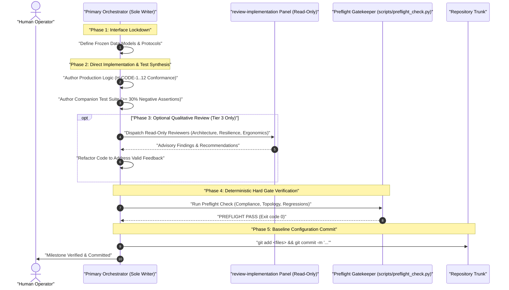

# Sovereign Engineering Implementation Pipeline Protocol (v5.0)

A deterministic, high-velocity engineering runbook enforcing the Sovereign Authoring Posture. The Primary Orchestrator directly authors production-grade code and companion test suites, maintaining zero-drift alignment with active contracts, while subagents serve exclusively as read-only qualitative reviewers.

---

## 1. Execution Routing Decision Matrix

Before proceeding, the primary orchestrator evaluates task complexity:

| Task Complexity Tier | Scope Criteria | Authoring Model | Quality Assurance Gate |
| :--- | :--- | :--- | :--- |
| **Tier 1: Atomic Edit** | Single-file tweak, < 100 lines | Direct Primary Execution | Automated lint & preflight check |
| **Tier 2: Feature Module** | Single module + tests, 100-300 lines | Direct Primary Authoring | 100% companion test pass + AST compliance |
| **Tier 3: Complex Subsystem** | Multi-file system, > 300 lines | Direct Authoring + Read-Only Review Panel | Multi-perspective read-only review + Full preflight |

---

## 2. Implementation & Verification Workflow



---

## 3. Core Verification Commands

```bash
# 1. Run Companion Test Suite
python -m unittest discover tests/

# 2. Run AST Compliance Gate
python scripts/compliance_checker.py <target_files...>

# 3. Run Full Preflight Verification
python scripts/preflight_check.py --quick
```
