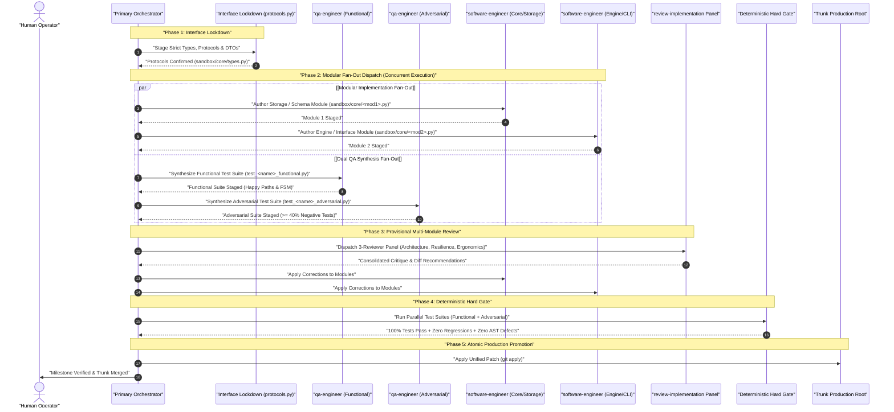

# Modular Multi-Agent IV&V Software Engineering Pipeline Protocol (v4.0)

A deterministic, high-velocity engineering runbook enforcing the Single Responsibility Principle (SRP),
Independent Verification and Validation (IV&V), and Interface-Locked Modular Parallelism. Decouples test
suite synthesis from code implementation, partitions complex systems into concurrent worker modules,
and gates promotion with automated AST and test suites.

---

## 1. Execution Routing Decision Matrix

Before dispatching subagents, the primary orchestrator SHALL evaluate the task scope against the
Execution Routing Decision Matrix:

| Task Complexity Tier | Scope Criteria | Execution Routing Model | Justification |
| :--- | :--- | :--- | :--- |
| **Tier 1: Atomic / Direct** | Single-file edit, $< 100$ lines, isolated helper | Direct Orchestrator Execution | Prevents token inflation and subagent dispatch latency tax. |
| **Tier 2: Focused Decoupled** | Single module, $100 - 250$ lines, 1 domain concern | Decoupled 2-Agent Pair (`SE` + `QA`) | Standard IV&V pipeline eliminating author confirmation bias. |
| **Tier 3: Modular Multi-Agent** | Multi-file system, $\ge 250$ lines, multiple domains | Interface-Locked Modular Parallelism | Maximizes delivery velocity via concurrent fan-out dispatch. |

---

## 2. Multi-Agent Delegation & Dispatch Protocol

When Tier 3 modular execution is initiated, the primary orchestrator SHALL coordinate the pipeline:



---

## 3. 5-Phase Modular Execution Pipeline

### Phase 1: Interface Lockdown
1. The orchestrator SHALL author or verify the canonical interface contract in `sandbox/core/types.py`
   or `sandbox/core/protocols.py` before spawning implementation workers.
2. The interface contract MUST define:
   - Explicit domain value objects and DTOs using `@dataclass(frozen=True)`.
   - Structural subtyping contracts using `typing.Protocol`.
   - Comprehensive type annotations without implicit `Any`.
3. The interface contract MUST pass AST compliance check:
   ```bash
   python scripts/compliance_checker.py sandbox/core/types.py
   ```

### Phase 2: Modular Fan-Out Parallel Dispatch
The orchestrator SHALL concurrently invoke specialized subagents using `invoke_subagent`:

1. **Modular Implementation Workers (`software-engineer`)**:
   - Each worker agent is scoped to a dedicated target file in `./sandbox/core/`.
   - Workers consume `protocols.py` to guarantee zero signature drift across boundaries.
   - Enforce KISS, YAGNI, SLAP, cyclomatic complexity $\le 10$, and parameter count $\le 7$.

2. **Dual QA Synthesis Verifiers (`qa-engineer`)**:
   - **Functional QA (`qa-engineer-functional`)**:
     - Targets `sandbox/tests/test_<name>_functional.py`.
     - Validates happy-path contracts, valid state transitions, and deterministic outputs.
   - **Adversarial QA (`qa-engineer-adversarial`)**:
     - Targets `sandbox/tests/test_<name>_adversarial.py`.
     - Enforces an elevated $\ge 40\%$ negative test ratio (`H-CODE-3`).
     - Injects simulated faults: file lock contention, process timeouts, corrupted inputs, and null values.

### Phase 3: Qualitative Review of Provisional Candidate Code
1. The orchestrator dispatches the **`review-implementation`** skill against all candidate draft files:
   - **`technical-reviewer-architecture`**: Audits domain abstraction honesty and protocol conformance.
   - **`technical-reviewer-resilience`**: Audits concurrency safety, resource cleanup, and timeout bounds.
   - **`technical-reviewer-ergonomics`**: Audits cognitive load, nesting depth, and parameter ergonomics.
2. Identified defects MUST be remediated by the respective `software-engineer` worker before confirmation.

### Phase 4: Deterministic Hard Gate Execution
The orchestrator executes both modular QA test suites and the full regression harness:
```bash
# 1. Run Functional QA Test Suite
python -m unittest sandbox/tests/test_<name>_functional.py

# 2. Run Adversarial QA Test Suite
python -m unittest sandbox/tests/test_<name>_adversarial.py

# 3. Run Full Repository Regression Suite
python -m unittest discover tests

# 4. Run Quantitative AST Compliance Gate
python scripts/compliance_checker.py sandbox/core/*.py sandbox/tests/*.py
```
- Every test MUST pass with exit code 0. Zero test failures, zero regressions, and zero AST defects.

### Phase 5: Atomic Production Promotion
1. Generate Unified Diff:
   ```bash
   python sandbox/scripts/create_task_<id>_diff.py
   ```
2. Execute pre-promotion dry-run:
   ```bash
   git apply --check --verbose sandbox/patch/task_<id>.diff
   ```
3. Apply patch atomically:
   ```bash
   git apply --whitespace=fix sandbox/patch/task_<id>.diff
   ```
4. Perform post-promotion regression check across the production root.
