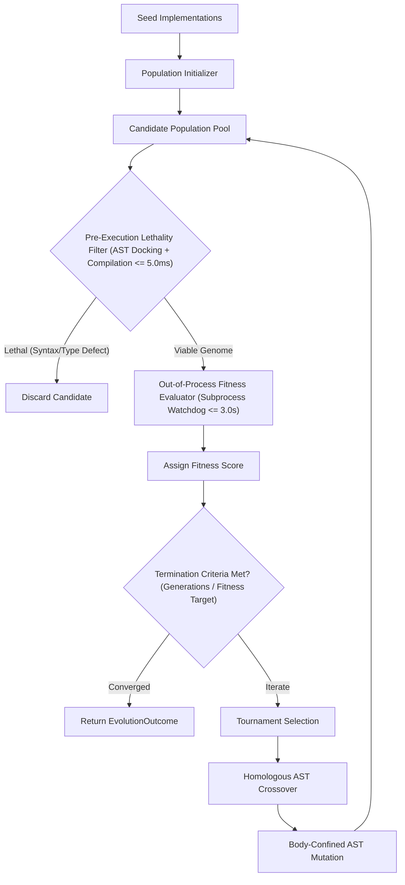
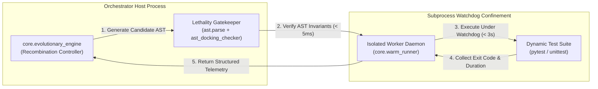

# Active Engineering Contract: AI-Native Evolutionary Recombination Engine (TASK-030)

> [!NOTE]
> ### Document Scope & Governance Authority
> This binding contract defines the operational invariants, typed interface schemas, and verification matrix for TASK-030: AI-Native Evolutionary Recombination Engine.
> - **Operational Standard**: Antigravity Engineering Constitution (`GEMINI.md` Section 3.5).
> - **Target Task ID**: `TASK-030`
> - **Validation Gate**: `python scripts/validate_active_contract.py --task TASK-030`

---

## 1. Executive Summary & Problem Formulation

The AI-Native Evolutionary Recombination Engine (`core/evolutionary_engine.py`) provides an automated, grammar-aware genetic algorithm subsystem for synthesizing and optimizing Python code modules. By operating directly on Python Abstract Syntax Trees (AST), the engine applies genetic operators (tournament selection, homologous crossover, point mutation) to evolve candidate implementations that conform to mechanical interface specifications.



---

## 2. Interface and Data Model Specifications

All interface protocols and frozen telemetry records are declared within `core/interfaces/evolutionary_engine_proto.py`.

### 2.1 Frozen Telemetry and Configuration Schemas

```python
"""Mechanical interface protocols and data models for evolutionary recombination engine."""

from __future__ import annotations

from dataclasses import dataclass
from typing import Any, Callable, Optional, Protocol, Tuple


@dataclass(frozen=True)
class EvolutionConfig:
    """Immutable configuration parameters for genetic algorithm evolution loop."""

    population_size: int = 20
    generations: int = 10
    mutation_rate: float = 0.1
    crossover_rate: float = 0.8
    tournament_size: int = 3
    lethality_ceiling_ms: float = 5.0
    watchdog_timeout_sec: float = 3.0
    seed: Optional[int] = None


@dataclass(frozen=True)
class MutantCandidate:
    """Immutable record of an individual program candidate in the population."""

    candidate_id: str
    source_code: str
    generation: int
    parent_ids: Tuple[str, ...] = ()
    fitness_score: float = 0.0
    is_lethal: bool = False
    mutation_type: str = "seed"


@dataclass(frozen=True)
class GenerationReport:
    """Immutable telemetry report summarizing population fitness metrics per generation."""

    generation_number: int
    best_fitness: float
    average_fitness: float
    lethal_count: int
    survivor_count: int
    elapsed_sec: float


@dataclass(frozen=True)
class EvolutionOutcome:
    """Immutable terminal result of complete evolutionary optimization run."""

    success: bool
    best_candidate: MutantCandidate
    generation_reports: Tuple[GenerationReport, ...] = ()
    total_generations: int = 0
    total_candidates_evaluated: int = 0
    termination_reason: str = "max_generations"
```

### 2.2 Mechanical Interface Protocols

```python
class FitnessEvaluatorProtocol(Protocol):
    """Protocol defining candidate code evaluation."""

    def evaluate(self, candidate_code: str) -> float:
        """Evaluate candidate code string and return numerical fitness score."""
        raise NotImplementedError("Protocol method must be implemented by concrete evaluator.")


class EvolutionaryEngineProtocol(Protocol):
    """Protocol defining genetic recombination and mutation operations."""

    def crossover(self, parent_a_code: str, parent_b_code: str) -> Tuple[str, str]:
        """Perform homologous AST crossover between two parent code representations."""
        raise NotImplementedError("Protocol method must be implemented by concrete engine.")

    def mutate(self, candidate_code: str) -> str:
        """Perform body-confined AST mutation on target candidate source code."""
        raise NotImplementedError("Protocol method must be implemented by concrete engine.")

    def evolve(
        self,
        seed_code: str,
        evaluator: FitnessEvaluatorProtocol,
        config: EvolutionConfig,
    ) -> EvolutionOutcome:
        """Execute complete genetic evolution loop starting from seed implementation."""
        raise NotImplementedError("Protocol method must be implemented by concrete engine.")
```

---

## 3. Normative System Invariants (NASA SP-2016-6105)

System invariants conform strictly to the NASA SP-2016-6105 single-thought mandate (zero compound conjunctions in binding normative requirements).

- `[INV-EVO-01]` The module core/interfaces/evolutionary_engine_proto.py SHALL define frozen data models (EvolutionConfig, MutantCandidate, GenerationReport, EvolutionOutcome) alongside protocols (FitnessEvaluatorProtocol, EvolutionaryEngineProtocol).
- `[INV-EVO-02]` Static AST docking between core/interfaces/evolutionary_engine_proto.py and core/evolutionary_engine.py SHALL evaluate to is_docked=True with 0 defects via core.ast_docking_checker.
- `[INV-EVO-03]` AST crossover and mutation operations SHALL enforce homologous grammar splicing restricting statement swaps to statements, expression swaps to expressions.
- `[INV-EVO-04]` Crossover and mutation operations SHALL treat Protocol class signatures plus method signatures as immutable genomes.
- `[INV-EVO-05]` Mutation operations SHALL restrict modifications strictly to method internal bodies.
- `[INV-EVO-06]` Every candidate individual SHALL pass compilation followed by verify_ast_docking within a 5.0 millisecond lethality ceiling prior to dynamic execution.
- `[INV-EVO-07]` Dynamic fitness evaluation of candidate code SHALL execute strictly out-of-process under a 3.0 second watchdog ceiling.
- `[INV-EVO-08]` CLI command python -m core.evolutionary_engine [--generations N] [--pop N] [--json] SHALL return exit code 0 upon successful execution.
- `[INV-EVO-09]` All functions in core/evolutionary_engine.py SHALL maintain cyclomatic complexity <= 10 with line lengths <= 120 columns.

---

## 4. NASA Verification Matrix (V-Matrix)

| Requirement ID | Target Metric | Degraded Threshold | Verification Method | Verification Tool / Command |
| :--- | :--- | :--- | :--- | :--- |
| `[INV-EVO-01]` | 4 Dataclasses, 2 Protocols defined | Missing types or mutable fields | Static AST Inspection | `python -m unittest tests/test_evolutionary_engine.py` |
| `[INV-EVO-02]` | `is_docked=True`, 0 defects | Any interface mismatch | Automated AST Docking Gate | `python -m core.ast_docking_checker --proto core/interfaces/evolutionary_engine_proto.py --impl core/evolutionary_engine.py` |
| `[INV-EVO-03]` | 100% Homologous AST Splices | Heterogeneous AST node swap | AST Invariant Unit Test | `pytest tests/test_evolutionary_engine.py -k test_homologous_splicing` |
| `[INV-EVO-04]` | Protocol signatures unchanged | Protocol genome mutated | AST Integrity Test | `pytest tests/test_evolutionary_engine.py -k test_signature_immutability` |
| `[INV-EVO-05]` | Method signature mutation == 0 | Outer signature modified | AST Scope Boundary Test | `pytest tests/test_evolutionary_engine.py -k test_mutation_body_only` |
| `[INV-EVO-06]` | Lethality filter latency <= 5.0ms | Processing duration > 5.0ms | Fast-Path Benchmark Test | `pytest tests/test_evolutionary_engine.py -k test_lethality_latency` |
| `[INV-EVO-07]` | Watchdog execution timeout == 3.0s | Process hang or leak | Subprocess Isolation Test | `pytest tests/test_evolutionary_engine.py -k test_watchdog_timeout` |
| `[INV-EVO-08]` | Exit code == 0 with JSON telemetry | Exit code != 0 | CLI Invocation Test | `python -m core.evolutionary_engine --generations 2 --pop 4 --json` |
| `[INV-EVO-09]` | CC <= 10, line lengths <= 120 | CC > 10 or length > 120 | Quantitative Compliance Gate | `python scripts/compliance_checker.py core/evolutionary_engine.py` |

---

## 5. Architectural Process & Sandbox Confinement Topology

The recombination engine operates inside the isolated `./sandbox/` filesystem hierarchy during development. Fitness evaluation runs strictly out-of-process to prevent untrusted candidate code from polluting the primary runtime environment.



---

## 6. Phased Implementation & Rollout Roadmap

1. **Phase 1 (Protocol & Schema Definition)**: Author `core/interfaces/evolutionary_engine_proto.py` declaring frozen data models and protocols.
2. **Phase 2 (AST Genetic Operators)**: Implement homologous statement/expression crossover and body-confined AST mutation in `core/evolutionary_engine.py`.
3. **Phase 3 (Lethality & Watchdog Harness)**: Implement sub-5ms static AST docking pre-filtering and 3.0s out-of-process execution watchdog.
4. **Phase 4 (CLI & Telemetry Surface)**: Add CLI runner supporting `--generations`, `--pop`, and `--json` flags with structured JSON exit.
5. **Phase 5 (Verification & Companion Test Suite)**: Author companion tests in `tests/test_evolutionary_engine.py` enforcing >= 30% negative assertions and clean AST.
