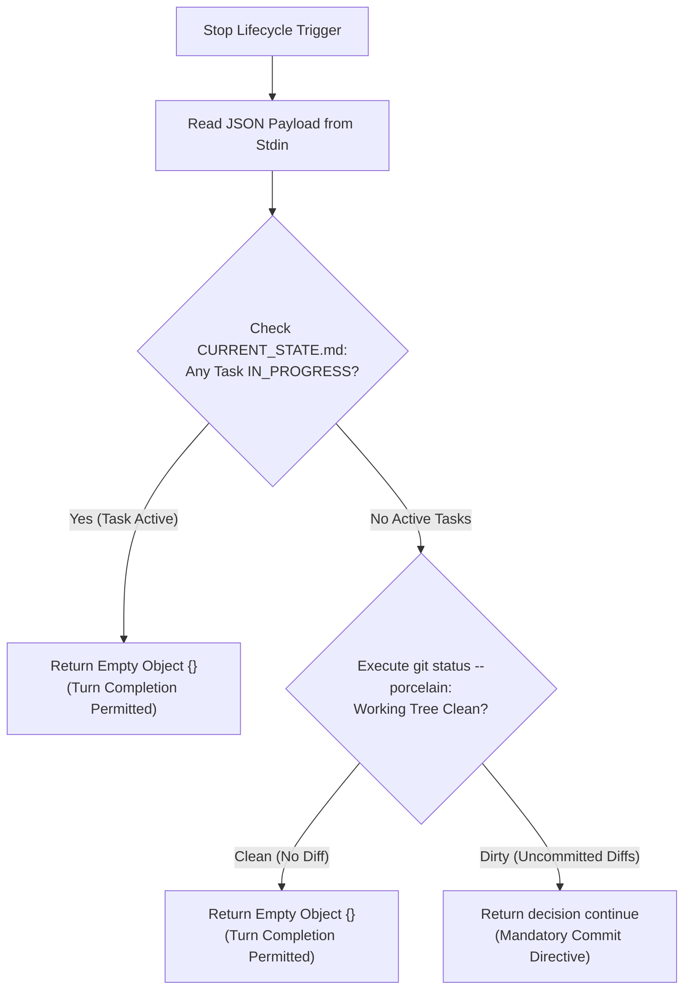
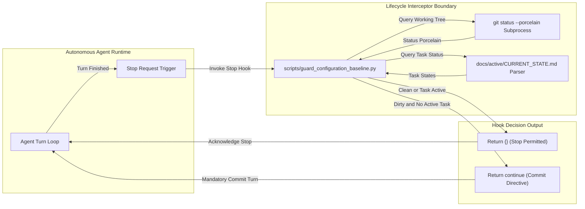

# Active Engineering Contract: Configuration Baseline & Run Completion Enforcement Hook (TASK-031)

> [!NOTE]
> ### Document Scope & Governance Authority
> This binding contract defines the operational invariants, typed interface schemas, and verification matrix for TASK-031: Configuration Baseline & Run Completion Enforcement Hook.
> - **Operational Standard**: Antigravity Engineering Constitution (`GEMINI.md` Section 3.5).
> - **Target Task ID**: `TASK-031`
> - **Validation Gate**: `python scripts/validate_active_contract.py --task TASK-031`

---

## 1. Executive Summary & Problem Formulation

The Configuration Baseline & Run Completion Enforcement Hook (`scripts/guard_configuration_baseline.py`) provides a deterministic lifecycle verification interceptor executed during the agent `Stop` lifecycle event. In autonomous multi-agent environments, agents may conclude a turn or finish an execution run while leaving modified files uncommitted or newly created artifacts untracked. In the absence of an active task, such uncommitted states represent configuration drift and unanchored mutations. Conversely, when a task is actively in progress, intermediate working tree modifications represent valid in-flight work.

To resolve this dichotomy deterministically, the configuration baseline guard intercepts turn termination requests:
1. When all tasks in `docs/active/CURRENT_STATE.md` have concluded (no tasks are `IN_PROGRESS`) and uncommitted git modifications exist, the hook intercepts termination and returns a `continue` decision instructing the agent to establish a configuration baseline and commit modifications.
2. When any task in `docs/active/CURRENT_STATE.md` remains `IN_PROGRESS`, the hook permits turn completion by returning an empty object (`{}`).
3. When the git working tree is clean (`git status --porcelain` is empty), the hook permits turn completion by returning an empty object (`{}`).



---

## 2. Interface and Data Model Specifications

The configuration baseline hook executes as a standalone Python CLI script adhering to the `.agents/hooks.json` schema specification.

### 2.1 Hook Execution Signature and Data Models

```python
"""Data models and execution schema for configuration baseline guard."""

from __future__ import annotations

from dataclasses import dataclass
from typing import Any, Dict, List, Optional, Tuple


@dataclass(frozen=True)
class ConfigurationBaselineReport:
    """Immutable report of configuration baseline and task lifecycle status."""

    active_tasks: Tuple[str, ...]
    uncommitted_files: Tuple[str, ...]
    is_git_clean: bool
    decision: str
    explanation: Optional[str] = None

    def to_hook_response(self) -> Dict[str, Any]:
        """Serializes result into canonical Stop hook JSON response dictionary."""
        if self.decision == "continue":
            return {
                "decision": "continue",
                "explanation": self.explanation or "Working tree contains uncommitted modifications.",
            }
        return {}


@dataclass(frozen=True)
class HookInvocationContext:
    """Immutable context received from Stop hook payload."""

    cwd: str
    transcript_path: Optional[str] = None
    stop_reason: Optional[str] = None
```

### 2.2 CLI Invocation Protocol

The guard script conforms to the standardized Antigravity CLI lifecycle hook interface:
- **Invocation Command**: `python scripts/guard_configuration_baseline.py`
- **Standard Input**: JSON payload with optional `stopHookActive`, `transcriptPath`, and environment parameters. If stdin is empty or unparseable, the script fails open gracefully and returns `{}`.
- **Standard Output**: Formatted JSON written to stdout:
  - Permitted termination: `{}`
  - Intercepted termination: `{"decision": "continue", "explanation": "..."}`
- **Exit Code**: Always `0` to prevent unhandled hook crashes in the agent harness.

---

## 3. Normative System Invariants (NASA SP-2016-6105)

System invariants conform strictly to the NASA SP-2016-6105 single-thought mandate (zero compound conjunctions in binding normative requirements).

- `[INV-SCM-01]` scripts/guard_configuration_baseline.py SHALL inspect git working tree status plus CURRENT_STATE.md task status upon Stop lifecycle invocation.
- `[INV-SCM-02]` When no tasks are IN_PROGRESS and git status contains uncommitted modifications, scripts/guard_configuration_baseline.py SHALL return decision continue with a mandatory commit directive.
- `[INV-SCM-03]` When any task is IN_PROGRESS, scripts/guard_configuration_baseline.py SHALL return an empty object permitting turn completion.
- `[INV-SCM-04]` When git status is clean, scripts/guard_configuration_baseline.py SHALL return an empty object permitting turn completion.
- `[INV-SCM-05]` All functions in scripts/guard_configuration_baseline.py SHALL maintain cyclomatic complexity <= 10 with line lengths <= 120 columns.
- `[INV-SCM-06]` .agents/hooks.json SHALL register configuration-baseline-guard under the Stop lifecycle event.
- `[INV-SCM-07]` Companion test tests/test_guard_configuration_baseline.py SHALL verify positive plus negative containment paths with a negative assertion ratio >= 30%.

---

## 4. NASA Verification Matrix (V-Matrix)

| Requirement ID | Target Metric | Degraded Threshold | Verification Method | Verification Tool / Command |
| :--- | :--- | :--- | :--- | :--- |
| `[INV-SCM-01]` | Status inspection latency $\le 100\text{ms}$ | $> 250\text{ms}$ | Unit Test & Subprocess Mock | `pytest tests/test_guard_configuration_baseline.py -k test_status_inspection` |
| `[INV-SCM-02]` | Return `continue` when dirty and idle | Permitted exit on dirty idle tree | Negative Security Integration Test | `pytest tests/test_guard_configuration_baseline.py -k test_dirty_no_active_task` |
| `[INV-SCM-03]` | Return `{}` when task is active | Blocked exit during active task | Positive Path Integration Test | `pytest tests/test_guard_configuration_baseline.py -k test_active_task_permits_stop` |
| `[INV-SCM-04]` | Return `{}` when tree is clean | Blocked exit on clean repository | Positive Path Integration Test | `pytest tests/test_guard_configuration_baseline.py -k test_clean_status_permits_stop` |
| `[INV-SCM-05]` | CC $\le 10$, Line Length $\le 120$ | CC $> 10$ or length $> 120$ | Quantitative Compliance Gate | `python scripts/compliance_checker.py scripts/guard_configuration_baseline.py` |
| `[INV-SCM-06]` | Hook registered under `Stop` | Missing hook configuration | JSON Schema Verification | `pytest tests/test_guard_configuration_baseline.py -k test_hooks_registration` |
| `[INV-SCM-07]` | Negative assertion ratio $\ge 30\%$ | Negative ratio $< 30\%$ | AST Ratio Audit | `pytest tests/test_guard_configuration_baseline.py -k test_negative_assertion_ratio` |

---

## 5. Architectural Process & Hook Confinement Topology

The configuration baseline hook executes within the orchestrator lifecycle boundary without direct write permissions to production code repositories.



---

## 6. Phased Implementation & Rollout Roadmap

1. **Phase 1 (Contract Acceptance)**: Author and ratify active engineering contract for `TASK-031` in `docs/active/ACTIVE_CONTRACT.md`.
2. **Phase 2 (Hook Implementation)**: Implement `scripts/guard_configuration_baseline.py` reading `git status --porcelain` and parsing `docs/active/CURRENT_STATE.md` with cyclomatic complexity $\le 10$ and line lengths $\le 120$.
3. **Phase 3 (Hook Registration)**: Register `configuration-baseline-guard` in `.agents/hooks.json` under the `Stop` lifecycle event.
4. **Phase 4 (Companion Verification Suite)**: Author `tests/test_guard_configuration_baseline.py` covering positive, negative, and degraded execution paths with $\ge 30\%$ negative assertion ratio.
5. **Phase 5 (Preflight & Promotion)**: Execute full automated compliance checking and test verification prior to sovereign operator promotion.
