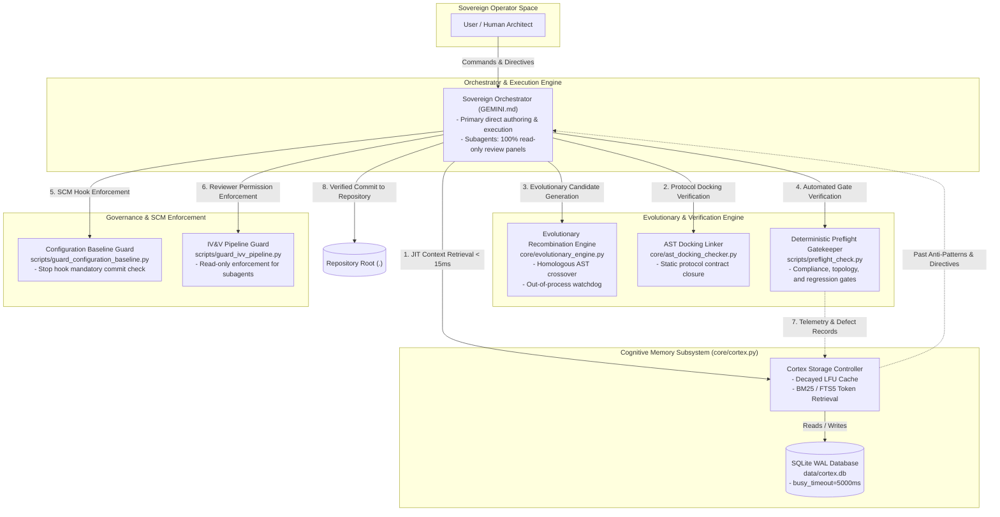
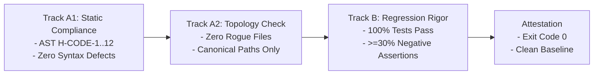

# Antigravity Lean Cortex: Physical System Blueprint (ARCHITECTURE.md v3.0)

> [!CAUTION]
> ### ON-CALL EMERGENCY TRIAGE (30-SECOND ACCESS)
> **Primary Diagnostics**: `python scripts/preflight_check.py --quick` | **Database Status**: `python -m core.cortex stats`
>
> | Incident Symptom | Suspected Subsystem | Deterministic Health Check | Immediate Recovery Action |
> | :--- | :--- | :--- | :--- |
> | **SQLite Lock Contention** | `core/cortex.py` | `python -m core.cortex stats` | Retry with exponential backoff or flush spool buffer |
> | **Test Suite Regression** | Test Suites | `python -m unittest discover tests/` | `git checkout -- tests/` |
> | **Preflight Gate Failure** | Quality Gates | `python scripts/preflight_check.py --verbose` | `python scripts/compliance_checker.py <failing_path>` |
> | **Corrupted Working Tree** | Repository Root (`.`) | `git status --porcelain` | `git checkout -- . && git clean -fd` |

---

## 1. Closed-Loop Physical Architecture Topology

The Antigravity platform operates as a deterministic, closed-loop cybernetic system where past operational memories actively ground planning, and verified solutions feed back into persistent storage.



---

## 2. Subsystem Interface Contracts

| Boundary | Transport Protocol | Request Payload | Response Contract | SLA / Timeout | Failure Containment |
| :--- | :--- | :--- | :--- | :--- | :--- |
| **`Orchestrator -> Cortex`** | Python In-Memory API | `query(symptom: str, top_k: int=3)` | `List[CortexRecord]` | `< 15ms` | Fallback to empty context (fail-open) |
| **`Cortex -> SQLite`** | SQLite C-API (WAL Mode) | Prepared SQL Statement | Row cursor / Affected count | `< 5ms` (busy: 5000ms) | In-memory ring buffer spooling |
| **`EvoEngine -> Subprocess`** | OS Process Execution | Code string + Test harness | Execution telemetry (stdout/stderr/exit) | `3.0s max` | Subprocess timeout; candidate marked lethal |
| **`Preflight -> QualityGates`** | Python In-Process API | Target paths + Test specs | Gate audit results (Pass/Fail) | `< 10.0s max` | Gate rejection; blocks task completion |
| **`Preflight -> Cortex`** | Python In-Process API | `record(outcome, trigger, directive)` | `{"event_id": str, "status": "STORED"}` | `< 25ms` | Log warning; does not crash pipeline |
| **`SCM Guard -> Git`** | Subprocess Execution | `git status --porcelain` | Status payload + commit directive | `< 5.0s max` | Intercepts turn stop if uncommitted changes exist |

---

## 3. Core Subsystems Specification

### 3.1 Cognitive Memory Engine (`core/cortex.py`)

The Cortex Memory Engine provides persistent semantic and episodic retrieval across agent context resets using **Decayed LFU (Least Frequently Used) Caching** combined with **SQLite FTS5 Full-Text Indexing**.

#### Physical DDL Schema (`data/cortex.db`)
```sql
PRAGMA journal_mode = WAL;
PRAGMA busy_timeout = 5000;
PRAGMA synchronous = NORMAL;
PRAGMA user_version = 2;

-- Episodic Event Ledger
CREATE TABLE IF NOT EXISTS episodic_events (
    id TEXT PRIMARY KEY,
    outcome TEXT CHECK(outcome IN ('SUCCESS', 'FAILURE')) NOT NULL,
    component TEXT NOT NULL,
    trigger_tokens TEXT NOT NULL,
    root_cause TEXT,
    directive TEXT NOT NULL,
    access_frequency INTEGER NOT NULL DEFAULT 1,
    recency_weight REAL NOT NULL DEFAULT 1.0,
    created_at TIMESTAMP NOT NULL DEFAULT CURRENT_TIMESTAMP,
    last_accessed_at TIMESTAMP NOT NULL DEFAULT CURRENT_TIMESTAMP
);

-- Full-Text Search (FTS5) Virtual Table for Sub-15ms Token Matching
CREATE VIRTUAL TABLE IF NOT EXISTS fts_events USING fts5(
    id UNINDEXED,
    component,
    trigger_tokens,
    directive,
    content='episodic_events',
    content_rowid='rowid'
);

-- Triggers for FTS Synchronization
CREATE TRIGGER IF NOT EXISTS trg_fts_insert AFTER INSERT ON episodic_events BEGIN
    INSERT INTO fts_events(rowid, id, component, trigger_tokens, directive)
    VALUES (new.rowid, new.id, new.component, new.trigger_tokens, new.directive);
END;
```

#### Recency Scoring & Retention Invariants
The recency weight degrades via a standard half-life formulation evaluated lazily upon access:
$$W(t) = W_0 \cdot 2^{-\Delta t / t_{\text{half}}} + \alpha \cdot \log(1 + f)$$
- **Half-life ($t_{\text{half}}$)**: 168 hours (7 days).
- **Frequency Bonus ($\alpha$)**: $0.15$.
- **Eviction Threshold**: Rows where $W(t) < 0.05$ and $f < 3$ are vacuumed during maintenance.

---

### 3.2 Out-of-Process Execution & Subprocess Watchdog Subsystem

To eliminate risks of infinite loops, memory exhaustion, or interpreter segfaults during dynamic evaluation, all untrusted candidate evaluations execute inside **isolated subprocesses bounded by strict watchdog ceilings**:

```bash
# Example Invocation via Evolutionary Engine CLI
python -m core.evolutionary_engine --generations 5 --pop 10 --json
```

#### Isolation & Anti-Pollution Invariants
1. **Address Space Isolation**: Candidate code runs in a dedicated Python subprocess via `subprocess.run()`. Unhandled exceptions, infinite recursion, or native segfaults terminate only the ephemeral child process.
2. **Watchdog Circuit Breaker**: Hard 3.0-second watchdog ceiling per candidate execution. Infinite loops or blocked I/O trigger immediate `subprocess.TimeoutExpired` and mark the candidate as lethal (`is_lethal=True`).
3. **Zero Host Pollution**: Candidate evaluations do not modify global interpreter state or shared modules.

---

### 3.3 Deterministic Preflight Gatekeeper (`scripts/preflight_check.py`)

Every codebase commit must pass all verification tracks prior to completion:

```bash
python scripts/preflight_check.py --quick
# Exit Code: 0 (PASS) | 1 (FAIL)
```



#### AST Anti-Cheat Rule Reference (`H-CODE-1` through `H-CODE-12`)
| Code | Rule | AST Pattern Target | Exemption |
| :--- | :--- | :--- | :--- |
| `H-CODE-1` | No Lazy Stubs | `ast.Pass`, `ast.Constant(...)` | Allowed in `@abstractmethod`, `Protocol`, or commented exception suppresses |
| `H-CODE-2` | No Tautological Asserts | `assert True`, `assert 1 == 1` | None |
| `H-CODE-3` | Negative Test Ratio | Test functions evaluating `assertRaises` or exception assertions | Must be >= 30% of total assertion count |
| `H-CODE-4` | Cross-Platform I/O | `open(..., encoding='utf-8')`, `pathlib.Path` | None |
| `H-CODE-5` | Secret Scanning | Regex entropy match on API keys / tokens | Local test fixtures in `tests/fixtures/` |
| `H-CODE-6` | Bare Except Ban | `except:` or `except Exception: pass` | Must log or explicitly re-raise |
| `H-CODE-7` | Bounded I/O | Network/DB/Subprocess calls without `timeout=` | None |
| `H-CODE-8` | Resource Cleanup | Unclosed file handles, sockets, DB connections | Context managers (`with`) mandatory |
| `H-CODE-9` | Deterministic Seeding | Unseeded `random.random()`, unseeded UUIDs in tests | Deterministic seed required |
| `H-CODE-10`| Typed Error Returns | Dummy fallback magic values (`-1`, `""`) | Typed `Result` / `Optional` required |
| `H-CODE-11`| Non-Destructive Migrations | Destructive `ALTER TABLE DROP COLUMN` | Phased deprecation required |
| `H-CODE-12`| Clean Namespace | Wildcard imports `from module import *` | Prohibited across all modules |

---

### 3.4 SCM Baseline & Lifecycle Governance

Project Autopoiesis enforces strict configuration baseline immutability:

```bash
# 1. Preflight Verification
python scripts/preflight_check.py --quick

# 2. Check Clean SCM Baseline
python scripts/guard_configuration_baseline.py --check-only

# 3. Emergency Revert (If Verification Fails)
git checkout -- . && git clean -fd
```
