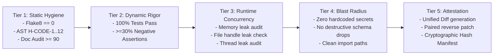

# Antigravity Lean Cortex: Physical System Blueprint (ARCHITECTURE.md v2.0)

> [!CAUTION]
> ### 🚨 ON-CALL EMERGENCY TRIAGE (30-SECOND ACCESS)
> **Active Dashboard**: `https://monitoring.internal/antigravity/cortex` | **On-Call Slack**: `#cortex-ops` | **PagerDuty**: `ANTIGRAVITY-CORE`
>
> | Incident Symptom | Suspected Subsystem | Deterministic Health Check | Immediate Recovery Action |
> | :--- | :--- | :--- | :--- |
> | **SQLite Lock Contention** | `core/cortex.py` | `sqlite3 .agents/knowledge/cortex.db "PRAGMA busy_timeout;"` | `python scripts/cortex_admin.py --checkpoint-truncate` |
> | **Test Runner Hung (>10s)** | `core/warm_runner.py` | `python -m core.warm_runner --diagnose-hangs` | `python -m core.warm_runner --kill-leaks --isolated` |
> | **Preflight Gate Failure** | `scripts/preflight_check.py` | `python scripts/preflight_check.py --explain-failure` | `python scripts/preflight_check.py --fix-lint-auto` |
> | **Corrupted Post-Promotion** | Sovereign Promotion | `git status --porcelain` | `git apply -R sandbox/patch/latest.diff || (git checkout -- . && git clean -fd)` |

---

## 1. Closed-Loop Physical Architecture Topology

The Antigravity Lean Cortex platform operates as a deterministic, closed-loop cybernetic system where past operational memories actively ground planning, and verified solutions feed back into persistent storage.

```mermaid
graph TD
    subgraph UserSpace["Sovereign Operator Space"]
        User["User / Human Architect"]
    end

    subgraph OrchestratorEngine["Orchestrator & Planning Engine"]
        DirectMode["Lean Direct Execution Engine (GEMINI.md)\n- In-process single-turn reasoning\n- SLA: sub-second prompt dispatch"]
    end

    subgraph MemorySubsystem["Physical Cortex Subsystem (core/cortex.py)"]
        Cortex["Cortex Storage Controller\n- Decayed LFU Cache\n- BM25 / FTS5 Token Retrieval"]
        CortexDB[("SQLite WAL Database\n.agents/knowledge/cortex.db\n- busy_timeout=5000ms")]
        Cortex -->|Reads / Writes| CortexDB
    end

    subgraph ExecutionSubsystem["Confinement & Execution Subsystems"]
        Sandbox["Sandbox Workspace\n./sandbox/\n- Ephemeral File Mutations"]
        WorkerPool["Pre-Warmed Worker Daemon Pool\ncore/warm_runner.py\n- Process-isolated harness\n- Watchdog: 3.0s per test"]
        Preflight["5-Tier Preflight Gatekeeper\nscripts/preflight_check.py\n- Tiers 1 through 5"]
        PromotionEngine["Sovereign Promotion Engine\nscripts/promote.py\n- Unified Diff & Reverse Patch"]
    end

    User -->|Prompts & Tokens| DirectMode
    DirectMode -->|1. JIT Context Retrieval < 15ms| Cortex
    Cortex -.->|Past Anti-Patterns & Directives| DirectMode
    DirectMode -->|2. Scaffolds Drafts| Sandbox
    Sandbox -->|3. Test Invocation Request| WorkerPool
    WorkerPool -->|4. Test Results & Coverage| Preflight
    Preflight -->|5a. Gated Pass (Manifest & Diff)| PromotionEngine
    Preflight -.->|5b. Write Verified Lesson / Failure Trace| Cortex
    PromotionEngine -->|6. Awaiting Explicit Approval| User
    PromotionEngine -->|7. Applied to Trunk| ProductionRoot[("Production Root (.)")]
```

---

## 2. Subsystem Interface Contracts

| Boundary | Transport Protocol | Request Payload | Response Contract | SLA / Timeout | Failure Containment |
| :--- | :--- | :--- | :--- | :--- | :--- |
| **`Orchestrator -> Cortex`** | Python In-Memory API | `query(symptom: str, top_k: int=3)` | `List[CortexRecord]` | `< 15ms` | Fallback to empty context (fail-open) |
| **`Cortex -> SQLite`** | SQLite C-API (WAL Mode) | Prepared SQL Statement | Row cursor / Affected count | `< 5ms` (busy: 5000ms) | In-memory ring buffer spooling |
| **`Sandbox -> WorkerPool`** | Named Pipe / Local IPC | `{"test_paths": [...], "env": {...}}` | `{"passed": int, "failed": int, "duration_ms": int}` | `10.0s max` | Hard `SIGKILL` on child; recycle daemon |
| **`WorkerPool -> Preflight`** | JSON IPC Report | Full Test Execution Telemetry | Verification Audit Matrix | `30.0s max` | Gate rejection; locks promotion pipeline |
| **`Preflight -> Cortex`** | Python Async / Event | `record(outcome, trigger, directive)` | `{"event_id": str, "status": "STORED"}` | `< 25ms` | Log warning; do not block promotion |
| **`Promotion -> Root`** | Git Diff & Atomic Staging | `task_patch.diff` | Execution report + rollback script | `5.0s max` | Instant revert (`git checkout -- .`) |

---

## 3. Core Subsystems Specification

### 3.1 Physical Cortex Memory Engine (`core/cortex.py`)

The Cortex Memory Engine provides persistent semantic and episodic retrieval across agent context resets. Neurobiological metaphors are abandoned in favor of formal, deterministic **Decayed LFU (Least Frequently Used) Caching** combined with **SQLite FTS5 Full-Text Indexing**.

#### Physical DDL Schema (`.agents/knowledge/cortex.db`)
```sql
PRAGMA journal_mode = WAL;
PRAGMA busy_timeout = 5000;
PRAGMA synchronous = NORMAL;
PRAGMA user_version = 2;

-- Episodic Event Ledger
CREATE TABLE IF NOT EXISTS episodic_events (
    id TEXT PRIMARY KEY,
    outcome TEXT CHECK(outcome IN ('SUCCESS', 'FAILURE')) NOT NULL,
    component TEXT NOT NULL,
    trigger_tokens TEXT NOT NULL,
    root_cause TEXT,
    directive TEXT NOT NULL,
    access_frequency INTEGER NOT NULL DEFAULT 1,
    recency_weight REAL NOT NULL DEFAULT 1.0,
    created_at TIMESTAMP NOT NULL DEFAULT CURRENT_TIMESTAMP,
    last_accessed_at TIMESTAMP NOT NULL DEFAULT CURRENT_TIMESTAMP
);

-- Full-Text Search (FTS5) Virtual Table for Sub-15ms Token Matching
CREATE VIRTUAL TABLE IF NOT EXISTS fts_events USING fts5(
    id UNINDEXED,
    component,
    trigger_tokens,
    directive,
    content='episodic_events',
    content_rowid='rowid'
);

-- Triggers for FTS Synchronization
CREATE TRIGGER IF NOT EXISTS trg_fts_insert AFTER INSERT ON episodic_events BEGIN
    INSERT INTO fts_events(rowid, id, component, trigger_tokens, directive)
    VALUES (new.rowid, new.id, new.component, new.trigger_tokens, new.directive);
END;
```

#### Recency Scoring & Retention Invariants
Instead of metaphysical decay formulas, the recency weight degrades via a standard half-life formulation evaluated lazily upon access:
$$W(t) = W_0 \cdot 2^{-\Delta t / t_{\text{half}}} + \alpha \cdot \log(1 + f)$$
- **Half-life ($t_{\text{half}}$)**: 168 hours (7 days).
- **Frequency Bonus ($\alpha$)**: $0.15$.
- **Eviction Threshold**: Rows where $W(t) < 0.05$ and $f < 3$ are vacuumed during weekly maintenance.

---

### 3.2 Pre-Warmed Worker Daemon Pool (`core/warm_runner.py`)

To eliminate the 50–200ms overhead of Windows `CreateProcessW` without compromising sandbox confinement, test suites execute inside a **persistent out-of-process worker daemon pool**:

```bash
# Invocation Command
python -m core.warm_runner --test-dir ./sandbox/tests --isolate --timeout-per-test 3.0 --json-report ./sandbox/test_report.json
```

#### Isolation & Anti-Pollution Invariants
1. **Address Space Isolation**: Worker runs in a dedicated subprocess connected via IPC pipes. An unhandled `sys.exit()` or native C-segmentation fault terminates only the ephemeral worker, never the host orchestrator.
2. **Watchdog Circuit Breaker**: Hard 3.0-second watchdog per test case. Infinite loops or blocked I/O trigger immediate `SIGKILL`.
3. **State Rollback Protocol**: The worker resets `sys.modules` to a clean baseline snapshot between test modules and un-patches all mocked objects.

---

### 3.3 5-Tier Preflight Gatekeeper (`scripts/preflight_check.py`)

Every candidate change must pass all 5 verification tiers prior to promotion eligibility:

```bash
python scripts/preflight_check.py --target-dir ./sandbox --strict
# Exit Code: 0 (PASS) | 1 (Tier 1 Fail) | 2 (Tier 2 Fail) | 3 (Tier 3 Fail) | 4 (Tier 4 Fail) | 5 (Tier 5 Fail)
```



#### AST Anti-Cheat Rule Reference (`H-CODE-1` through `H-CODE-12`)
| Code | Rule | AST Pattern Target | Exemption |
| :--- | :--- | :--- | :--- |
| `H-CODE-1` | No Lazy Stubs | `ast.Pass`, `ast.Constant(...)` | Allowed in `@abstractmethod`, `Protocol`, or commented exception suppresses |
| `H-CODE-2` | No Tautological Asserts | `assert True`, `assert 1 == 1` | None |
| `H-CODE-3` | Negative Test Ratio | Test functions evaluating `pytest.raises` or exception assertions | Must be >= 30% of total assertion count |
| `H-CODE-4` | Cross-Platform I/O | `open(..., encoding='utf-8')`, `pathlib.Path` | None |
| `H-CODE-5` | Secret Scanning | Regex entropy match on API keys / tokens | Local test fixtures in `tests/fixtures/` |
| `H-CODE-6` | Bare Except Ban | `except:` or `except Exception: pass` | Must log or explicitly re-raise |
| `H-CODE-7` | Bounded I/O | Network/DB/Subprocess calls without `timeout=` | None |
| `H-CODE-8` | Resource Cleanup | Unclosed file handles, sockets, DB connections | Context managers (`with`) mandatory |
| `H-CODE-9` | Deterministic Seeding | Unseeded `random.random()`, unseeded UUIDs in tests | Deterministic seed required |
| `H-CODE-10`| Typed Error Returns | Dummy fallback magic values (`-1`, `""`) | Typed `Result` / `Optional` required |
| `H-CODE-11`| Non-Destructive Migrations | Destructive `ALTER TABLE DROP COLUMN` | Phased deprecation required |
| `H-CODE-12`| Clean Namespace | Wildcard imports `from module import *` | Prohibited across all modules |

---

### 3.4 Sovereign Promotion & Rollback Engine (`scripts/promote.py`)

Promotion transfers verified changes from `./sandbox/` to the production root under explicit human authorization.

```bash
# 1. Pre-Promotion Dry-Run (Zero Blast Radius)
python scripts/promote.py --dry-run --patch sandbox/patch/task_101.diff
# Expected Output: "PRE_PROMOTION_OK: Patch applies cleanly without merge conflicts."

# 2. Atomic Promotion Execution
python scripts/promote.py --execute --patch sandbox/patch/task_101.diff

# 3. Post-Promotion Verification
python scripts/preflight_check.py --target-dir . --quick

# 4. Instant Emergency Rollback (If Step 3 Fails)
python scripts/promote.py --rollback --patch sandbox/patch/task_101.diff
```
