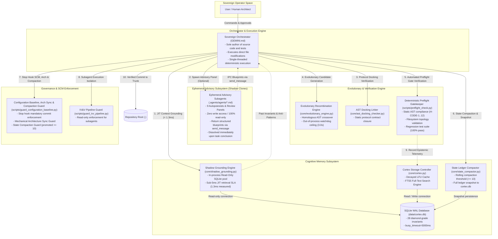
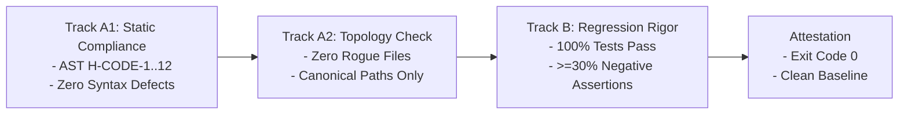

# Antigravity Lean Cortex: Living Physical System Blueprint (ARCHITECTURE.md v4.0)

> [!CAUTION]
> ### ON-CALL EMERGENCY TRIAGE (30-SECOND ACCESS)
> **Primary Diagnostics**: `python scripts/preflight_check.py --quick` | **Database Status**: `python -m core.cortex stats`
>
> | Incident Symptom | Suspected Subsystem | Deterministic Health Check | Immediate Recovery Action |
> | :--- | :--- | :--- | :--- |
> | **SQLite Lock Contention** | `core/cortex.py` | `python -m core.cortex stats` | Retry with exponential backoff or inspect connection pool |
> | **Test Suite Regression** | Test Suites | `python -m unittest discover tests/` | Revert failing tests via `git checkout -- tests/` |
> | **Preflight Gate Failure** | Quality Gates | `python scripts/preflight_check.py --verbose` | Inspect defect line via `python scripts/compliance_checker.py <path>` |
> | **Architecture Sync Interception** | SCM Stop Hook | `python scripts/guard_configuration_baseline.py --check-only` | Update `docs/active/ARCHITECTURE.md` to reflect modified `core/` modules |
> | **Corrupted Working Tree** | Repository Root (`.`) | `git status --porcelain` | Execute atomic reset: `git checkout -- . && git clean -fd` |

---

## 1. Closed-Loop Physical Architecture Topology

Project Autopoiesis operates as a deterministic, closed-loop cybernetic software development platform. Past verified solutions and anti-patterns actively ground real-time code authoring through sub-5ms JIT memory retrieval, while mechanical quality gates and Stop hooks enforce architectural immutability.



---

## 2. Subsystem Interface Contracts

| Boundary | Transport Protocol | Request Payload | Response Contract | Latency SLA / Timeout | Failure Containment |
| :--- | :--- | :--- | :--- | :--- | :--- |
| **`Orchestrator -> ShadowGrounding`** | Python In-Memory API | `query_knowledge_in_process(symptom, top_k=3)` | `List[ShadowGroundingRecord]` | `< 5.0ms` (actual ~1.3ms) | Fallback to empty context list (fail-open) |
| **`ShadowGrounding -> SQLite`** | Read-Only Connection Pool | Parameterized SQL query | Row tuples | `< 2.0ms` | Thread-local connection recycle |
| **`Orchestrator -> Cortex`** | Python In-Memory API / CLI | `record(outcome, trigger, directive)` | Event ID string / JSON dict | `< 25.0ms` | Spooling to in-memory ring buffer |
| **`Cortex -> SQLite`** | SQLite C-API (WAL Mode) | Parameterized DML statement | Affected row count | `< 5.0ms` (busy: 5000ms) | Exponential backoff retry with jitter |
| **`Orchestrator -> StateCompactor`** | Python In-Process API / CLI | `compact_state_ledger(target_path)` | `StateCompactionReport` dict | `< 100ms` | Fail-open fallback; retains original ledger |
| **`StateCompactor -> CortexDocs`** | Python In-Process API | `snapshot_state_ledger(content)` | Revision ID string | `< 25ms` | Spooling to cortex.db state_revisions |
| **`EvoEngine -> Subprocess`** | OS Process Execution | Candidate code string + Test harness | Telemetry dict (stdout, stderr, exit code) | `3.0s hard ceiling` | Subprocess timeout; candidate marked lethal |
| **`Preflight -> QualityGates`** | Python In-Process API | Target paths + Suite specifications | Gate report (Pass/Fail) | `< 10.0s max` | Gate rejection; blocks task completion |
| **`Stop Hook -> SCM & Arch Sync`** | Python Subprocess Execution | Hook stdin context JSON | Stop hook JSON response dict | `< 5.0s max` | Blocks turn completion if uncommitted or unsynced |

---

## 3. Core Subsystems Specification

### 3.1 Cognitive Memory & Shadow Grounding Engine (`core/cortex.py` & `core/shadow_grounding.py`)

The Cognitive Memory subsystem provides persistent semantic retrieval across context resets using **Decayed LFU (Least Frequently Used) Caching** combined with **SQLite FTS5 Full-Text Indexing**. To eliminate read-lock contention on Windows, high-velocity queries execute via a dedicated in-process read-only connection pool.

#### Physical DDL Schema (`data/cortex.db`)
```sql
PRAGMA journal_mode = WAL;
PRAGMA busy_timeout = 5000;
PRAGMA synchronous = NORMAL;
PRAGMA user_version = 2;

-- Episodic Event Ledger (Purified Knowledge SSOT)
CREATE TABLE IF NOT EXISTS episodic_events (
    id TEXT PRIMARY KEY,
    outcome TEXT CHECK(outcome IN ('SUCCESS', 'FAILURE')) NOT NULL,
    component TEXT NOT NULL,
    trigger_tokens TEXT NOT NULL,
    root_cause TEXT,
    directive TEXT NOT NULL,
    access_frequency INTEGER NOT NULL DEFAULT 1,
    recency_weight REAL NOT NULL DEFAULT 1.0,
    created_at TIMESTAMP NOT NULL DEFAULT CURRENT_TIMESTAMP,
    last_accessed_at TIMESTAMP NOT NULL DEFAULT CURRENT_TIMESTAMP
);

-- Full-Text Search (FTS5) Virtual Table for Sub-5ms Token Matching
CREATE VIRTUAL TABLE IF NOT EXISTS fts_events USING fts5(
    id UNINDEXED,
    component,
    trigger_tokens,
    directive,
    content='episodic_events',
    content_rowid='rowid'
);

-- Automated Triggers for FTS Synchronization
CREATE TRIGGER IF NOT EXISTS trg_fts_insert AFTER INSERT ON episodic_events BEGIN
    INSERT INTO fts_events(rowid, id, component, trigger_tokens, directive)
    VALUES (new.rowid, new.id, new.component, new.trigger_tokens, new.directive);
END;

CREATE TRIGGER IF NOT EXISTS trg_fts_delete AFTER DELETE ON episodic_events BEGIN
    INSERT INTO fts_events(fts_events, rowid, id, component, trigger_tokens, directive)
    VALUES ('delete', old.rowid, old.id, old.component, old.trigger_tokens, old.directive);
END;
```

#### Read-Only Connection Pooling (`_ReadOnlyPool`)
- **Connection Isolation**: Queries run through `sqlite3.connect(f"file:{db_path}?mode=ro", uri=True)`. Read operations never acquire SQLite RESERVED or EXCLUSIVE locks.
- **Microsecond Latency**: Prepared queries against FTS5 execute in ~1.3ms, safely inside the 5.0ms SLA budget.
- **Fail-Open Resilience**: If the database file is absent or locked by an external process, `query_knowledge_in_process` falls back to empty results without throwing uncaught exceptions.

#### Recency Scoring Formulation
Recency weight degrades via a standard half-life formulation evaluated lazily upon access:
$$W(t) = W_0 \cdot 2^{-\Delta t / t_{\text{half}}} + \alpha \cdot \log(1 + f)$$
- **Half-life ($t_{\text{half}}$)**: 168 hours (7 days).
- **Frequency Bonus ($\alpha$)**: $0.15$.
- **Eviction Threshold**: Records with $W(t) < 0.05$ and $f < 3$ are vacuumed during scheduled maintenance.

---

### 3.2 Ephemeral Advisory Subsystem (Shadow Clones)

Conforming to GEMINI.md Section 2.1 (**Sovereign Authoring Posture**), subagents operate strictly as ephemeral, read-only advisory consultants:

1. **Zero Write Authority**: Subagents possess zero authority to create, edit, or delete files, and cannot run mutating shell commands.
2. **Disposable 1-Time Lifecycle**: Clones are spawned on demand for specialized dialectical audit or adversarial red-teaming, and dissolve immediately upon relaying their findings.
3. **IPC Backpropagation**: All discoveries, candidate algorithms, and review rubrics backpropagate exclusively to the sovereign orchestrator via `send_message`.
4. **Single-Threaded Authoring**: The sovereign orchestrator alone synthesizes clone insights and authors sequential, deterministic code modifications.

---

### 3.3 Out-of-Process Execution & Subprocess Watchdog Subsystem (`core/evolutionary_engine.py`)

To eliminate risks of infinite loops, memory exhaustion, or interpreter segfaults during dynamic candidate evaluation, untrusted candidate code executes inside **isolated subprocesses bounded by strict watchdog ceilings**:

```bash
# Example Invocation via Evolutionary Engine CLI
python -m core.evolutionary_engine --generations 5 --pop 10 --json
```

#### Invariant Protections
1. **Homologous AST Crossover**: Statements swap strictly with statements (`ast.stmt <-> ast.stmt`) and expressions swap strictly with expressions (`ast.expr <-> ast.expr`), preventing malformed syntax trees.
2. **Immutable Signature Genomes**: Protocol interfaces and outer method signatures remain immutable; mutations and crossovers operate strictly within function bodies.
3. **Watchdog Circuit Breaker**: Hard 3.0-second watchdog ceiling per candidate execution. Unhandled loops or blocked I/O trigger immediate `subprocess.TimeoutExpired` and mark the candidate as lethal (`is_lethal=True`).
4. **Zero Host Pollution**: Candidate evaluations execute out-of-process, guaranteeing zero pollution of host memory or global interpreter state.

---

### 3.4 Static AST Docking Linker (`core/ast_docking_checker.py`)

The AST Docking Linker verifies that implementation classes satisfy defined Protocol interfaces mechanically before deployment:

```bash
python -m core.ast_docking_checker --proto core/interfaces/evolutionary_engine_proto.py --impl core/evolutionary_engine.py --json
# Output: {"is_docked": true, "defects": []}
```

- **Compile-Time Contract Validation**: Ensures method names, argument types, return types, and decorators match interface definitions without requiring dynamic imports.
- **Fail-Fast Defense**: Rejects implementations with missing methods or signature drifts prior to dynamic test execution.

---

### 3.5 Deterministic Preflight Gatekeeper (`scripts/preflight_check.py`)

Every codebase modification must clear all verification tracks prior to promotion:

```bash
python scripts/preflight_check.py --quick
# Exit Code: 0 (PASS) | 1 (FAIL)
```



#### AST Anti-Cheat Rule Reference (`H-CODE-1` through `H-CODE-12`)
| Code | Rule | AST Pattern Target | Exemption |
| :--- | :--- | :--- | :--- |
| `H-CODE-1` | No Lazy Stubs | `ast.Pass`, `ast.Constant(...)` | Allowed in `@abstractmethod`, `Protocol`, or commented exception suppresses |
| `H-CODE-2` | No Tautological Asserts | `assert True`, `assert 1 == 1` | None |
| `H-CODE-3` | Negative Test Ratio | Test functions evaluating `assertRaises` or exception assertions | Must be >= 30% of total assertion count |
| `H-CODE-4` | Cross-Platform I/O | `open(..., encoding='utf-8')`, `pathlib.Path` | None |
| `H-CODE-5` | Secret Scanning | Regex entropy match on API keys / tokens | Local test fixtures in `tests/fixtures/` |
| `H-CODE-6` | Bare Except Ban | `except:` or `except Exception: pass` | Must log or explicitly re-raise |
| `H-CODE-7` | Bounded I/O | Network/DB/Subprocess calls without `timeout=` | None |
| `H-CODE-8` | Resource Cleanup | Unclosed file handles, sockets, DB connections | Context managers (`with`) mandatory |
| `H-CODE-9` | Deterministic Seeding | Unseeded `random.random()`, unseeded UUIDs in tests | Deterministic seed required |
| `H-CODE-10`| Typed Error Returns | Dummy fallback magic values (`-1`, `""`) | Typed `Result` / `Optional` required |
| `H-CODE-11`| Non-Destructive Migrations | Destructive `ALTER TABLE DROP COLUMN` | Phased deprecation required |
| `H-CODE-12`| Clean Namespace | Wildcard imports `from module import *` | Prohibited across all modules |

---

### 3.6 SCM Baseline, Architecture Sync & State Compaction Guard (`scripts/guard_configuration_baseline.py`)

To prevent architecture documentation from decaying into a dead specification and state ledgers from overflowing token budgets, the Antigravity Stop Hook enforces three mechanical quality gates:

1. **Architecture Sync Guard**:
   - When any file in `core/` is created, modified, or deleted, `scripts/guard_configuration_baseline.py` inspects the working tree.
   - If `core/` was modified but `docs/active/ARCHITECTURE.md` is absent from the changeset, the hook blocks turn conclusion with `decision="continue"` and directive:
     `[ARCHITECTURE SYNC REQUIRED] Core modules were modified in this run, but docs/active/ARCHITECTURE.md was not updated. Mandatory Architecture Sync Invariant: You MUST review and reflect physical architecture changes in docs/active/ARCHITECTURE.md before concluding.`
2. **State Compaction Guard**:
   - When total promoted tasks in `docs/active/CURRENT_STATE.md` reach 10 or more, the hook blocks turn conclusion with `decision="continue"` and directive:
     `[STATE COMPACTION REQUIRED] docs/active/CURRENT_STATE.md contains N promoted tasks (ceiling is 10). Mandatory State Compaction Invariant: You MUST compact CURRENT_STATE.md using python -m core.cortex compact-ledger before concluding.`
3. **Configuration Baseline Guard**:
   - When no tasks are `IN_PROGRESS` and uncommitted changes exist, the hook blocks turn conclusion until the operator or agent commits the working tree (`git add . && git commit -m '...'`).
4. **Fail-Open Operational Safety**:
   - In the event of transient git timeouts or malformed hook payloads, the script fails open cleanly without crashing the developer environment.

---

### 3.7 State Ledger Rolling Compactor & Cortex Snapshot Engine (`core/state_compactor.py` & `core/cortex_docs.py`)

The State Ledger Compaction subsystem prevents token bloat and context degradation caused by historical task accumulation in `docs/active/CURRENT_STATE.md`:

```bash
# Example Invocation via Cortex CLI
python -m core.cortex compact-ledger --target docs/active/CURRENT_STATE.md
```

#### Core Invariants & Mechanics
1. **Rolling Task Horizon (Max 10 Threshold)**:
   - When total promoted tasks in `CURRENT_STATE.md` reach 10 or more, compaction is mechanically required.
   - The compactor prunes older completed tasks from both the Kanban board (`ColPromoted`) and the task ledger table, retaining strictly the most recent 5 completed tasks.
2. **Deterministic Epistemic Snapshot (`core/cortex_docs.py`)**:
   - Prior to modifying the ledger, `snapshot_state_ledger()` captures the complete raw markdown into `state_revisions` in `data/cortex.db`.
   - The revision is immediately indexed into `fts_archive_search` virtual table, enabling instant full-text search across all historical tasks via `python -m core.cortex query-archive "<query>"`.
3. **Physical Historical Archive Document**:
   - Pruned tasks are serialized into structured markdown archives under `docs/archived/` (e.g. `TASK_ARCHIVE_027_030.md`), preserving audit trails and verification evidence permanently in git.
4. **Mechanical Stop Hook Enforcement**:
   - `check_state_compaction()` intercepts every Stop lifecycle event. If an operator or agent forgets to compact the ledger when >= 10 tasks accumulate, turn conclusion is blocked until compaction executes.

