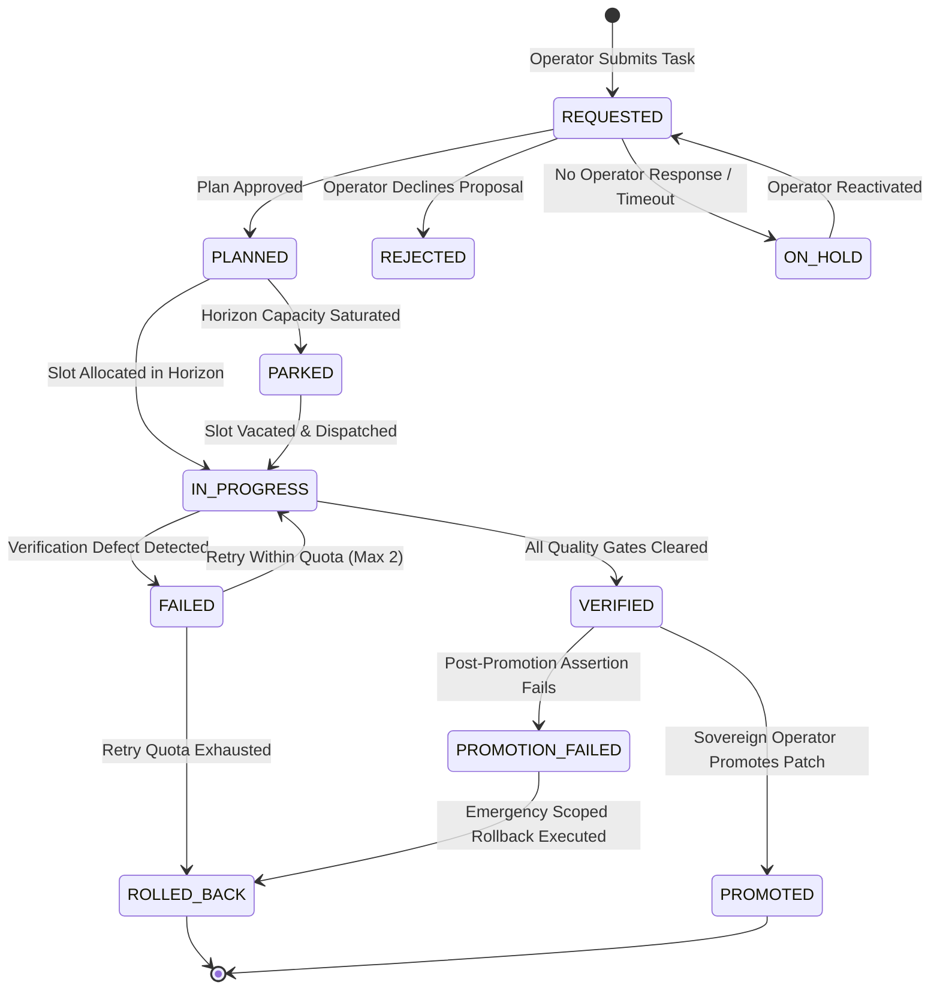
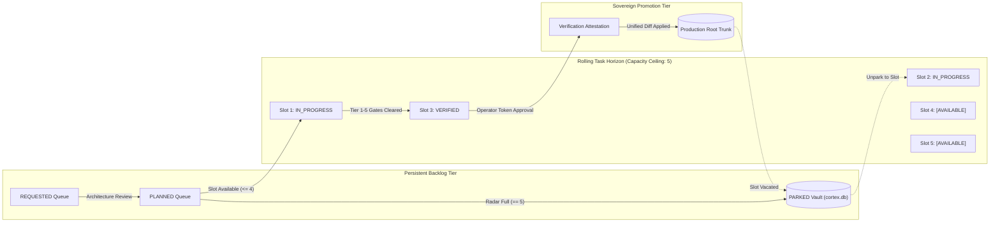
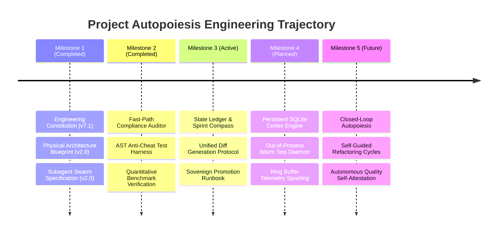

# Project Autopoiesis Current State Ledger and Sprint Compass (v2.0)

> [!NOTE]
> ### Document Scope & Governance Authority
> This specification functions as the authoritative runtime ledger and sprint compass for Project Autopoiesis.
> - **Operational Standard**: Binding specification under the Antigravity Engineering Constitution (`GEMINI.md`).
> - **Automated Compliance Auditor**: `python scripts/compliance_checker.py sandbox/docs/active/CURRENT_STATE.md`
> - **Concurrency Mandate**: Updates to state records MUST execute via atomic file rename operations or dedicated state management tooling.

---

## 1. Multi-Tier Audience Fast-Paths

### 1.1 Executive Fast-Path (< 60 Seconds)
- **Mission Posture**: Project Autopoiesis establishes a self-referential, closed-loop cybernetic software development platform where architectural specifications, autonomous multi-agent panels, and codebases co-evolve deterministically.
- **Current Operational Phase**: Phase 1 (Governance Hardening & Verification Foundation).
- **Active Sprint Horizon**: Sprint 1 ("Governance Hardening & Self-Verification Engine").
- **Core Trade-Off**: Strict preflight gating and sandbox isolation impose an authoring latency tax (+15% to +25% per cycle) to guarantee 0% production regression rates and sub-30-second atomic rollbacks.
- **Active Task Capacity**: 0 of 5 active slots occupied (0% utilization; 5 slots available).

### 1.2 On-Call Incident Fast-Path (< 30 Seconds)
**Severity Classification**: SEV-1 (Trunk Regression / Data Loss) | SEV-2 (Gate / Harness Deadlock)  
**Triage Dashboard**: `https://monitoring.internal/antigravity/cortex`  
**Escalation Channel**: Slack `#ops-oncall` | PagerDuty `ANTIGRAVITY-CORE-ONCALL`

> [!CAUTION]
> **Production Protection Invariant**: Autonomous agents SHALL NOT apply unverified diffs directly to the production repository root.

| Incident Trigger | Impacted Subsystem | Immediate Diagnostic Command | Immediate Remediation Directive |
| :--- | :--- | :--- | :--- |
| **Corrupted Production State** | Repository Root (`.`) | `git status --porcelain` | `git apply -R --whitespace=fix sandbox/patch/${TASK_ID}.diff` |
| **Hanging Test Harness (>10s)** | Warm Runner (`core.warm_runner`) | `python -m core.warm_runner --diagnose-hangs` | `python -m core.warm_runner --stop --force \|\| taskkill /F /PID <pid> /T` |
| **State File Concurrency Lock** | Ledger (`docs/active/CURRENT_STATE.md`) | `python scripts/audit_blast_radius.py --diff-target HEAD` | `python -m core.state_manager retry-lock --file docs/active/CURRENT_STATE.md --backoff-ms 50 --max-retries 5` |
| **Compliance Gate Rejection** | Quality Gates | `python scripts/compliance_checker.py` | `python scripts/compliance_checker.py --explain` |

---

## 2. Task Lifecycle State Machine & Rolling Task Horizon

### 2.1 Complete Lifecycle State Transitions
Task progression strictly follows a deterministic finite state machine (FSM). Each state transition requires verified evidence before advancing.



### 2.2 Rolling Task Horizon Invariant (Max 5 Active Tasks)
To prevent cognitive overload, context compaction failure, and work-in-progress (WIP) starvation, active tasks are bound by the Rolling Task Horizon:



1. **Active Horizon Capacity**: Active tasks (`IN_PROGRESS` + `VERIFIED`) MUST NOT exceed 5 concurrent items.
2. **Overflow Parking Protocol**: When all 5 active slots are occupied, any newly approved task MUST receive `PARKED` status.
3. **Storage Invariant**: Parked tasks MUST be persisted into `cortex.db` with an explicit reason record. Prior to Milestone 4 implementation of `cortex.db`, parked tasks MUST use filesystem fallback storage (`sandbox/state/parked_tasks.json`).
4. **Promotion Replenishment**: When an active task transitions to `PROMOTED` or `ROLLED_BACK`, the highest-priority `PARKED` task MAY transition to `IN_PROGRESS`.
5. **Silence Is Not Consent Invariant (묵시적 승인 금지)**: When an interactive elicitation (`ask_question`), review panel, or task proposal encounters a timeout or absence of explicit operator response, the task MUST NOT auto-advance to `PLANNED` or `IN_PROGRESS`. It MUST transition to `ON_HOLD` or `PARKED` with an explicit reason record, awaiting sovereign operator reactivation.

---

## 3. Active Sprint Radar & Kanban Board

### 3.1 Kanban Board Topology

```mermaid
flowchart TD
    subgraph ColRequested ["1. REQUESTED"]
        REQ_100["[No Requested Tasks]"]
    end

    subgraph ColPlanned ["2. PLANNED"]
        PLN_100["[No Planned Tasks]"]
    end

    subgraph ColParked ["PARKED (cortex.db)"]
        PRK_100["[No Parked Tasks]"]
    end

    subgraph ColActive ["3. IN_PROGRESS (Horizon)"]
        ACT_100["[Available Slot: Ready for Dispatch]"]
    end

    subgraph ColVerified ["4. VERIFIED (Preflight Passed)"]
        VER_100["[Verification Pipeline Cleared]"]
    end

    subgraph ColPromoted ["5. PROMOTED (Trunk Merged)"]
        PRM_101["TASK-001: Antigravity Constitution (v7.1)"]
        PRM_102["TASK-002: Physical Blueprint (v2.0)"]
        PRM_103["TASK-003: Subagent Swarm Guide (v2.0)"]
        PRM_104["TASK-004: Compliance Checker Engine (v1.0)"]
        PRM_105["TASK-005: State Ledger Specification (v2.0)"]
        PRM_109["TASK-009: Pre-Approval Doc Lint Gate (v1.0)"]
        PRM_110["TASK-010: Socratic Interviewer & Active Contract (v1.0)"]
        PRM_111["TASK-011: Socratic Interviewer Hardening (v1.1)"]
        PRM_112["TASK-012: Tri-Domain Cortex Document Archiving (v1.0)"]
        PRM_113["TASK-013: Filesystem Topology Standards (v1.0)"]
        PRM_114["TASK-014: Standalone Agent Runner & Execution Harness (v1.0)"]
        PRM_115["TASK-015: Lead Software Engineer Persona & Delegation Protocol (v1.0)"]
        PRM_116["TASK-016: Autonomous Agent Registry Specification (v1.0)"]
        PRM_117["TASK-017: Independent QA Engineer & Decoupled IV&V (v1.0)"]
        PRM_107["TASK-007: SQLite Cortex Knowledge Persistence (v1.0)"]
        PRM_118["TASK-018: Modular Multi-Agent & Dual QA Pipeline (v4.0)"]
        PRM_106["TASK-006: Out-of-Process Warm Runner Harness (v1.0)"]
        PRM_119["TASK-019: System Hygiene, Sanitation & Technical Debt Elimination (v1.0)"]
        PRM_120["TASK-020: Core Test Engine Encapsulation & Facade Bridge (v1.0)"]
        PRM_121["TASK-021: Closed-Loop Continuous Learning & Grounding System (v1.0)"]
        PRM_122["TASK-022: Context Diet & Attention Shielding Architecture (v1.0)"]
        PRM_123["TASK-023: Automated IV&V Lifecycle Enforcement Hook (v1.0)"]
        PRM_124["TASK-024: Active Contract Gate & SSOT Lifecycle Hardening (v1.0)"]
        PRM_125["TASK-025: Preflight Defect Diagnostics & Cortex Ingestion (v1.0)"]
        PRM_126["TASK-026: Requirements Extractor & Subprocess Backprop Pipeline (v1.0)"]
        PRM_108["TASK-008: Scheduled LFU Cache Vacuuming Routine (v1.0)"]
        PRM_127["TASK-027: Mechanical Interface Skeleton Baker & AST Docking Linker (v1.0)"]
        PRM_128["TASK-028: Dialectical Requirements Interrogator & Adversarial Red Team Engine (v1.0)"]
        PRM_129["TASK-029: Resilient Exponential Backoff Retry Policy Engine (v1.0)"]
        PRM_130["TASK-030: AI-Native Evolutionary Recombination Engine (v1.0)"]
    end

    ColPlanned -->|"Assign Available Slot"| ColActive
    ColActive -->|"Pass Preflight Tiers"| ColVerified
    ColVerified -->|"Human Applies Patch"| ColPromoted
```



### 3.2 Current State Task Ledger

| Task ID | Task Description | Lifecycle Status | Retries [Used/Max] | Blast Radius Tier | Owner | Verification Gate |
| :--- | :--- | :--- | :---: | :--- | :--- | :--- |
| **`TASK-001`** | Author Antigravity Constitution (`GEMINI.md`) | `PROMOTED` | 0/2 | Tier 1 (Docs) | Platform Lead | 100% CI pass; Trunk merged |
| **`TASK-002`** | Author Physical Blueprint (`ARCHITECTURE.md`) | `PROMOTED` | 0/2 | Tier 1 (Docs) | Principal Architect | 100% CI pass; Trunk merged |
| **`TASK-003`** | Register 6 Review Subagents & Guide (`SPEC-0001`) | `PROMOTED` | 0/2 | Tier 1 (Docs) | Agent Architect | 100% CI pass; Trunk merged |
| **`TASK-004`** | Implement Quantitative Compliance Checker | `PROMOTED` | 0/2 | Tier 2 (Code) | Systems Engineer | 22 unit tests passed (0.015s) |
| **`TASK-005`** | Author State Ledger & Sprint Compass Specification | `PROMOTED` | 0/2 | Tier 1 (Docs) | Technical Writer | 100% Doc review pass (98.4/100) |
| **`TASK-009`** | Implement Pre-Approval Doc Lint Gate & Hardened Example | `PROMOTED` | 0/2 | Tier 2 (Code) | Systems Engineer | 28 unit tests passed; Clean AST |
| **`TASK-010`** | Implement Socratic Interviewer & Active Contract Gate | `PROMOTED` | 0/2 | Tier 1 (Docs) | Agent Architect | 100% Preflight passed; Clean AST |
| **`TASK-011`** | Harden Socratic Interviewer & Active Contract Gate | `PROMOTED` | 0/2 | Tier 2 (Agent Spec) | Agent Architect | 100% Preflight passed; Clean AST |
| **`TASK-012`** | Implement Tri-Domain Cortex Document Archiving | `PROMOTED` | 0/2 | Tier 2 (Code) | Database Engineer | 19 companion tests pass (0.67s); Clean AST |
| **`TASK-013`** | Implement Filesystem Topology Standards & Engine | `PROMOTED` | 0/2 | Tier 2 (Code) | Systems Engineer | 21 companion tests pass (0.054s); Audit pass (6.7ms); Clean AST |
| **`TASK-014`** | Implement Standalone Subprocess Agent Runner & Execution Harness | `PROMOTED` | 0/2 | Tier 2 (Code) | Systems Engineer | 17 companion tests pass (0.90s); 100% compliance gate; Clean AST |
| **`TASK-015`** | Lead Software Engineer Persona & Delegation Protocol | `PROMOTED` | 0/2 | Tier 1 (Agent Spec) | Platform Architect | 100% compliance pass (3/3 files); Subprocess pass (0.11s) |
| **`TASK-016`** | Author Autonomous Agent Registry Specification | `PROMOTED` | 0/2 | Tier 1 (Docs) | Platform Architect | 100% Pre-Approval Lint pass; 100% compliance pass; Clean AST |
| **`TASK-017`** | Implement Independent QA Engineer & Decoupled IV&V Pipeline | `PROMOTED` | 0/2 | Tier 2 (Code/Agent) | Platform Lead | 100% compliance pass (5/5 files); Subprocess pass; 85 unit tests pass |
| **`TASK-006`** | Implement Out-of-Process Warm Runner Harness | `PROMOTED` | 0/2 | Tier 2 (Code) | Systems Engineer | 131 unit tests passed; 3.0s watchdog ceiling; Clean AST |
| **`TASK-007`** | Implement SQLite Cortex Knowledge Persistence | `PROMOTED` | 0/2 | Tier 2 (Code) | Database Engineer | 106 unit tests passed (3.37s); FTS5 < 15ms; Clean AST |
| **`TASK-008`** | Implement LFU Cache Vacuuming Scheduled Routine | `PROMOTED` | 0/2 | Tier 2 (Code) | Systems Engineer | 33 companion tests pass (0.97s); 294 full tests pass; Clean AST; Fail-open verified. |
| **`TASK-018`** | Implement Modular Multi-Agent & Dual QA Pipeline (v4.0) | `PROMOTED` | 0/2 | Tier 2 (Agent Spec) | Platform Architect | 119 unit tests passed; 46.2% negative ratio; Clean AST |
| **`TASK-019`** | System Hygiene, Sanitation & Technical Debt Elimination | `PROMOTED` | 0/2 | Tier 3 (Governance) | Systems Lead | 100% compliance pass (34/34 files, 0 defects); 131 tests pass |
| **`TASK-020`** | Core Test Engine Encapsulation & Facade Bridge | `PROMOTED` | 0/2 | Tier 2 (Code) | Systems Architect | 100% compliance pass (38/38 files, 0 defects); 132 tests pass |
| **`TASK-021`** | Closed-Loop Continuous Learning & Grounding System | `PROMOTED` | 0/2 | Tier 2 (Code) | Platform Lead | 100% compliance pass (38/38 files, 0 defects); Grounding CLI verified; 135 tests pass |
| **`TASK-022`** | Context Diet & Attention Shielding Architecture | `PROMOTED` | 0/2 | Tier 2 (Code) | Systems Architect | 100% preflight pass (39 files, 70 topology, 146 tests); Clean AST |
| **`TASK-023`** | Automated IV&V Lifecycle Enforcement Hook | `PROMOTED` | 0/2 | Tier 2 (Code) | Systems Architect | 100% preflight pass (41 files, 73 topology, 165 tests); Clean AST |
| **`TASK-024`** | Active Contract Gate & SSOT Lifecycle Hardening | `PROMOTED` | 0/2 | Tier 2 (Code) | Systems Architect | 100% preflight pass (44 files, 76 topology, 193 tests); Clean AST |
| **`TASK-025`** | Automated Preflight Defect Diagnostics & Cortex Ingestion | `PROMOTED` | 0/2 | Tier 2 (Code) | Systems Architect | 31 companion tests pass (0.35s); 224 full tests pass; Clean AST; Fail-open verified. |
| **`TASK-026`** | Requirements Extractor & Subprocess Backpropagation Pipeline | `PROMOTED` | 0/2 | Tier 2 (Code) | Platform Architect | 32 companion tests pass (1.54s); 261 full tests pass; Clean AST; Fail-open verified. |
| **`TASK-027`** | Mechanical Interface Skeleton Baker & AST Docking Linker | `PROMOTED` | 0/2 | Tier 2 (Code) | Platform Lead | 50 companion tests pass (0.74s); 344 full tests pass; Clean AST; Fail-open verified. |
| **`TASK-028`** | Dialectical Requirements Interrogator & Adversarial Red Team Engine | `PROMOTED` | 0/2 | Tier 2 (Code) | Platform Lead | 31 companion tests pass (8.11s); 375 full tests pass; Clean AST; Fail-open verified. |
| **`TASK-029`** | Resilient Exponential Backoff Retry Policy Engine | `PROMOTED` | 0/2 | Tier 2 (Code) | Systems Engineer | 45 companion tests pass (0.35s); 420 full tests pass; Clean AST; AST Docked; Fail-open verified. |
| **`TASK-030`** | AI-Native Evolutionary Recombination Engine | `PROMOTED` | 0/2 | Tier 2 (Code) | Systems Engineer | 41 companion tests pass (0.99s); 461 full tests pass; Clean AST; AST Docked; Fail-open verified. |

---

## 4. Contiguous Non-Functional Requirements (NFR) Matrix

System performance boundaries are defined by contiguous, non-overlapping ASCII intervals:

| Evaluation Dimension | Nominal State (Green) | Degraded State (Yellow) | Critical Failure (Red) | Mitigation & Recovery Directive |
| :--- | :--- | :--- | :--- | :--- |
| **Compliance Check Time** | `Duration <= 500ms` | `500ms < Duration <= 1500ms` | `Duration > 1500ms` | Prune file collection scope; profile AST parsing |
| **Active Task Concurrency**| `0 <= Tasks <= 4` (Nominal Idle/Active) | `Tasks == 5` (Capacity Saturated) | `Tasks > 5` (Capacity Violation) | Enforce rolling horizon limit; transition task to PARKED |
| **Warm Runner Test Watchdog**| `Duration <= 3000ms` | `3000ms < Duration <= 5000ms`| `Duration > 5000ms` | Terminate worker process via PID-targeted kill; recycle daemon |
| **Rollback SLA** | `Recovery <= 10s` | `10s < Recovery <= 30s` | `Recovery > 30s` | Execute emergency reverse patch: git apply -R sandbox/patch/${TASK_ID}.diff |
| **SQLite Busy Timeout** | `Wait <= 200ms` | `200ms < Wait <= 5000ms` | `Wait > 5000ms` | Spool event traces to in-memory fallback ring buffer |

---

## 5. System Invariants & NASA Normative Directives

Technical directives and system invariants are defined below conforming to NASA SP-2016-6105 Rev 2.

### 5.1 Architectural and Lifecycle Directives
- `[REQ-STATE-01]` The orchestrating agent SHALL maintain sandbox isolation during active development.
- `[REQ-STATE-02]` The orchestrating agent SHALL NOT write unverified source code directly into the production root.
- `[REQ-STATE-03]` The state ledger SHALL maintain a concurrency ceiling of at most 5 active tasks.
- `[REQ-STATE-04]` When 5 tasks are active, incoming tasks SHALL receive PARKED status.
- `[REQ-STATE-05]` Every state transition in the task ledger SHALL be accompanied by an evidentiary artifact.
- `[REQ-STATE-06]` State ledger updates SHALL execute via atomic file transactions.
- `[REQ-STATE-07]` The test suite SHALL enforce a negative assertion ratio of at least 30 percent.
- `[REQ-STATE-08]` Unit test cases SHALL NOT contain tautological assertions.
- `[REQ-STATE-09]` Production functions SHALL NOT contain placeholder pass statements.
- `[REQ-STATE-10]` Python source code SHALL limit function parameter counts to at most 7 parameters.
- `[REQ-STATE-11]` The system SHALL execute compliance verification in less than 500 milliseconds.
- `[REQ-STATE-12]` All candidate production diffs MUST include a corresponding reverse-patch rollback script.
- `[REQ-STATE-13]` Post-execution reporting for all governance, specification, and architectural state transitions SHALL provide full, unabridged Korean architectural exposition alongside verbatim unified diffs.

### 5.2 Procedural Directives for Engineers and Operators
- **DO**: Run `python scripts/compliance_checker.py` before proposing pull requests.
- **DO**: Verify that reverse-patch dry runs succeed cleanly before applying candidate patches.
- **DO**: Monitor the active task horizon count to prevent capacity saturation.
- **DON'T**: Bypass compliance failure exits using command-line overrides during nominal operation.
- **DON'T**: Commit hardcoded absolute local developer file paths to repository specifications.
- **DON'T**: Exceed 120 character line limits in production Python source code.

---

## 6. Epistemic Ledger (Facts, Assumptions, Hypotheses)

> [!NOTE]
> ### Validated Fact `[FACT-AUTO-TASK-026-TEST]`
> - **Source / Evidence**: Falsified assumption transitioned via task TASK-026-TEST.
> - **Validated Finding**: Windows sleep without jitter causes SQLite lock


Major system assertions are formally categorized to guarantee epistemic integrity:

> [!NOTE]
> ### Validated Fact `[FACT-001]`
> - **Source / Evidence**: Unit test execution on Windows Python 3.12 (`python -m unittest tests/test_compliance_checker.py`).
> - **Verified Metric**: 22 unit tests executed in 0.015 seconds with 0 defects detected.
> - **Operational Invariant**: Fast-path compliance checking executes well within the 500ms nominal threshold.

> [!NOTE]
> ### Validated Fact `[FACT-002]`
> - **Source / Evidence**: AST inspection and regex validation in `scripts/compliance_checker.py`.
> - **Verified Metric**: Automated detection of lazy stubs, tautological assertions, parameter overflows (>7), cyclomatic complexity (>10), banned marketing words, multiple H1 headings, and compound SHALL statements.

> [!WARNING]
> ### Working Assumption `[ASSUMP-001]`
> - **Assumption**: Single-operator workflow permits atomic file replacement on NTFS without concurrent file lock exceptions.
> - **Invalidation Threshold**: File access collision observed during automated concurrent test runs.
> - **Mitigation Plan**: Implement retry loop with exponential backoff (50ms initial, 5 retries) in `core.state_manager`.

> [!IMPORTANT]
> ### Hypothesis `[HYP-001]`
> - **Hypothesis**: Maintaining a strict rolling task horizon of at most 5 tasks reduces task completion cycle time by at least 25 percent.
> - **Falsification Metric**: Average lead time for TASK completion does not improve across 15 sprint iterations.

---

## 7. Architectural Milestones & Trajectory Roadmap



### 7.1 Milestone Status Matrix
1. **Milestone 1: Governance & Swarm Protocols** (`STATUS: COMPLETE`)
   - Completed: `GEMINI.md`, `ARCHITECTURE.md`, `SUBAGENT_INVOCATION_GUIDE.md`.
2. **Milestone 2: Quantitative Verification Engine** (`STATUS: COMPLETE`)
   - Completed: `scripts/compliance_checker.py`, `tests/test_compliance_checker.py` (22 tests passed).
3. **Milestone 3: State Ledger & Promotion Protocol** (`STATUS: ACTIVE`)
   - Target: Standardized task horizon management, unified diff production, and reverse patch safety.
4. **Milestone 4: Persistent Cortex & Worker Daemon Pool** (`STATUS: PLANNED`)
   - Target: `core/cortex.py` SQLite WAL implementation, `core/warm_runner.py` daemon harness.
5. **Milestone 5: Sovereign Autopoietic Evolution** (`STATUS: PLANNED`)
   - Target: Closed-loop architecture where verified execution lessons dynamically ground future planning.

---

## 8. Operational Runbook: Sovereign Promotion & Emergency Rollback

This runbook defines the mandatory 4-phase protocol for promoting sandbox artifacts to the production root.

### 8.1 Promotion Procedure

#### Step 1: Pre-Promotion Dry-Run Assertion
> [!NOTE]
> **Blast Radius**: Zero. Read-only assertion evaluating patch applicability against current trunk state.

1. **Pre-Check Command**:
   ```bash
   git apply --check --verbose sandbox/patch/${TASK_ID}.diff
   ```
2. **Expected Verification Output**:
   ```text
   Checking patch sandbox/patch/<task_id>.diff...
   <Exit Code 0: Patch applies cleanly without merge conflicts>
   ```

#### Step 2: Atomic Patch Application
> [!CAUTION]
> **Blast Radius**: High. Modifies production trunk files specified in the diff manifest.
> **Abort Thresholds**: Abort execution immediately if uncommitted trunk changes exist (`git status --porcelain` is non-empty) or if patch application produces offset/fuzz warnings.

1. **Execution Command**:
   ```bash
   git apply --whitespace=fix sandbox/patch/${TASK_ID}.diff
   ```

#### Step 3: Immediate Deterministic Verification
1. **Verification Command**:
   ```bash
   python scripts/compliance_checker.py
   ```
2. **Expected Verification Output**:
   ```text
   Summary: Audited N file(s) | Defects Found: 0
   VERDICT: APPROVED (100% Quantitative Compliance Passed)
   ```

#### Step 4: Emergency Scoped Reverse-Patch Rollback
Execute this rollback procedure immediately if Step 3 returns a non-zero exit code:

1. **Scoped Reverse-Patch Execution**:
   ```bash
   git apply -R --whitespace=fix sandbox/patch/${TASK_ID}.diff
   ```
   > [!CAUTION]
   > **Sandbox Protection Constraint**: Engineers SHALL NOT execute blanket cleanup commands such as `git clean -fd`. Blanket cleanup deletes untracked sandbox experimentation files.

2. **Rollback Verification Assertion**:
   Verify that trunk files cleanly revert to baseline while untracked sandbox files remain intact:
   ```bash
   git status --porcelain
   # Expected Output: Zero modified trunk files; untracked sandbox files (?? sandbox/...) preserved.
   ```

3. **Atomic Task Ledger Rollback Transaction**:
   Following reverse-patch application, an atomic ledger transaction MUST transition the task status in `CURRENT_STATE.md` to `ROLLED_BACK`:
   ```bash
   python -m core.state_manager update-task --id ${TASK_ID} --status ROLLED_BACK --reason "Preflight verification failure post-promotion"
   ```

---

## 9. Automated Quality Gate & Self-Verification Protocol

Every modification to this document MUST pass the automated compliance checker prior to promotion:

```bash
# Quantitative Compliance Audit
python scripts/compliance_checker.py sandbox/docs/active/CURRENT_STATE.md
# Expected Exit Code: 0
```

| Verification Target | Enforcement Mechanism | Deterministic Gate Pass Criteria |
| :--- | :--- | :--- |
| **YAML Frontmatter Integrity** | AST / Schema Parser | Keys present: id, title, status, owner, last_reviewed |
| **Top-Level H1 Heading** | Regular Expression Scanner | Exactly one top-level '# ' heading |
| **Epistemic Modals & Fluff** | Lexicon Pattern Matcher | 0 occurrences of banned marketing adjectives |
| **Atomic Single-Thought Directives** | Conjunction AST Matcher | Zero compound normative conjunction violations |
| **Contiguous NFR Intervals** | Structural Review | Contiguous ASCII inequality ranges across all metrics |
