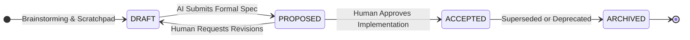
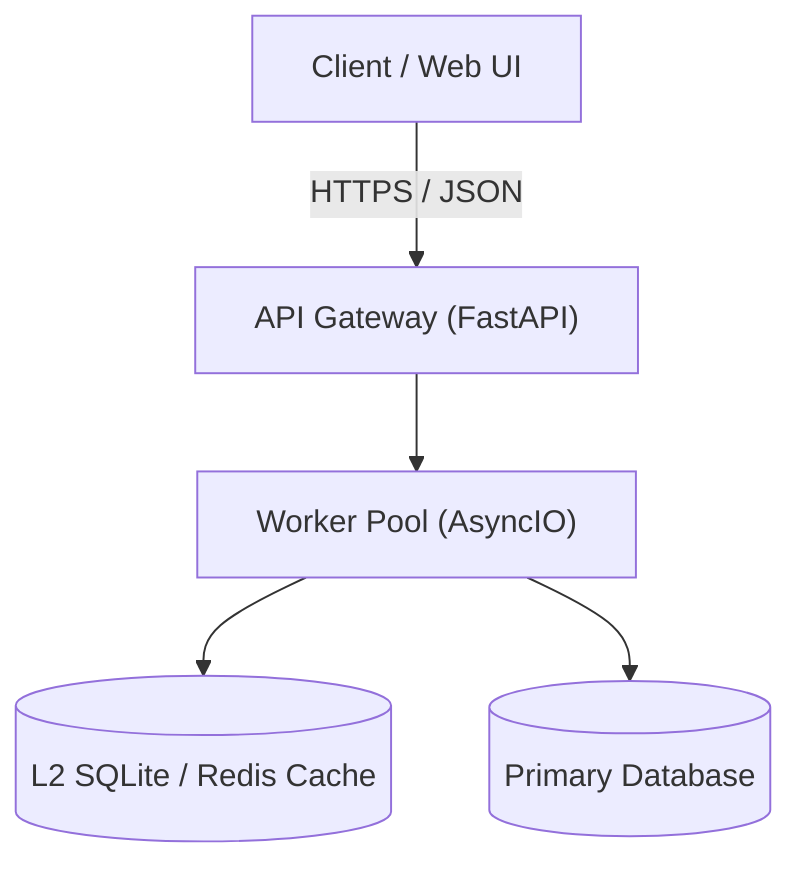
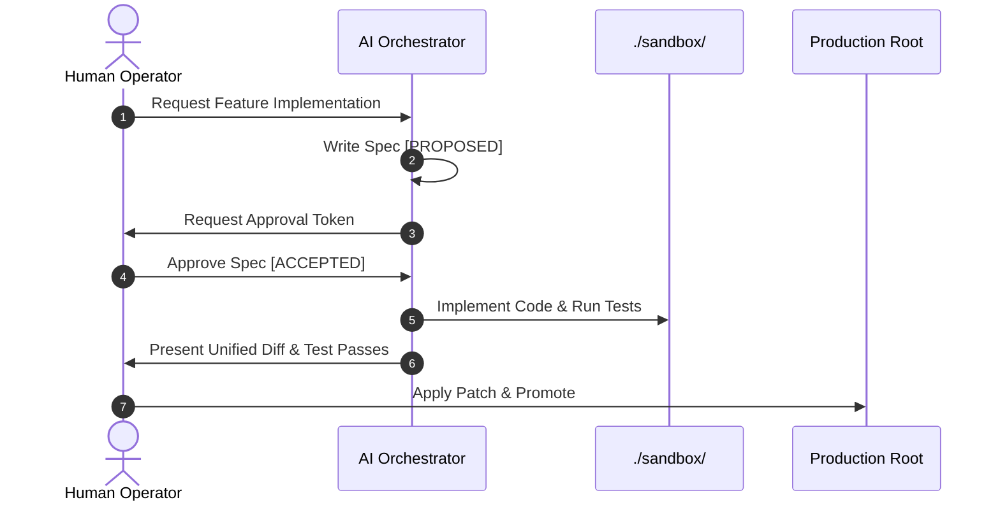
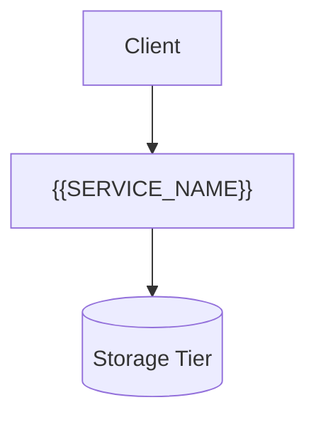

# Enterprise Technical Documentation Structural Specification (Streamlined v2.1)

> [!NOTE]
> ### 1-Person + AI Pair Governance Contract
> This specification defines the structural standards and review lifecycle for architecture docs, RFCs, and runbooks.
> - **Primary Rule**: The AI Agent MUST keep documents in `PROPOSED` status until the human developer explicitly approves implementation (`ACCEPTED`).
> - **Automated Validator**: `python scripts/validate_doc_frontmatter.py`

---

## 1. Streamlined 4-Stage Document Lifecycle

Every formal document begins with a lightweight YAML frontmatter tracking ownership and state:

```yaml
---
id: "ADR-20260906-cache-engine" # Format: <TYPE>-YYYYMMDD-<kebab-name>
title: "Local Cache Engine Architecture"
status: "PROPOSED" # Allowed: DRAFT | PROPOSED | ACCEPTED | ARCHIVED
owner: "lead-developer"
last_reviewed: "2026-09-06"
supersedes: null # Optional: ID of previous document replaced by this
---
```

### 1.1 State Machine (Human-in-the-Loop Gateway)



- **`DRAFT`**: Work in progress. Open for collaborative exploration, prototyping notes, and brainstorming.
- **`PROPOSED`**: AI agent has finalized the technical design and submitted it for review. **The AI agent SHALL NOT modify production code until the human moves status to `ACCEPTED`.**
- **`ACCEPTED`**: Human developer has approved the proposal. This document is now the active single source of truth binding codebase implementation.
- **`ARCHIVED`**: Superseded by a newer design or retired. Kept for historical context (replaces complex `SUPERSEDED`/`DEPRECATED` states).

---

## 2. Focused Architectural Modeling (Mermaid)

Instead of maintaining duplicate Level 1 and Level 2 diagrams, technical specs require **one clear, high-signal Architecture Diagram** and (if dealing with concurrency or async state) **one Sequence Diagram**.

All node labels containing parentheses, spaces, or slashes MUST be wrapped in double quotes to guarantee deterministic Mermaid parsing.

### 2.1 Unified Architecture Topology


### 2.2 Dynamic Protocol / State Sequence (When Async or Multi-Step)


---

## 3. The 4-Metric Contiguous NFR Matrix

Architecture specs and RFCs must define operational boundaries using contiguous ASCII thresholds across four non-negotiable dimensions:

| Dimension | Nominal State (Green) | Degraded State (Yellow) | Critical Failure (Red) | Mitigation & Fallback Action |
| :--- | :--- | :--- | :--- | :--- |
| **Throughput** | `1,000 <= QPS <= 5,000` | `5,001 <= QPS <= 8,000` | `QPS > 8,000` OR `< 100` | Shed excess traffic via HTTP 429; alert if QPS < 100 |
| **P99 Latency** | `P99 <= 20ms` | `20ms < P99 <= 50ms` | `P99 > 50ms` | Fallback to stale read from local cache (TTL: 60s) |
| **Availability** | `Uptime >= 99.9%` | `99.0% <= Uptime < 99.9%` | `Uptime < 99.0%` | Automatic restart of failing worker container |
| **Rollback SLA** | `Recovery <= 30s` | `30s < Recovery <= 60s` | `Recovery > 60s` | Trigger automated reverse patch (`git apply -R`) |

---

## 4. Deterministic Verification Table (Replaces NASA V-Matrix)

Rather than filling abstract aerospace inspection matrices, system requirements must be directly mapped to runnable test commands and deterministic pass criteria:

| Req ID | Requirement Statement | Verification Command | Pass Criteria |
| :--- | :--- | :--- | :--- |
| `[REQ-01]` | Gateway **SHALL** reject unauthenticated requests. | `pytest tests/test_auth.py -k "test_unauth"` | Exit code 0 (HTTP 401 emitted) |
| `[REQ-02]` | Memory consumption **SHALL NOT** exceed 512MB under load. | `python scripts/check_memory_profile.py` | Peak RSS <= 512MB over 5m run |
| `[REQ-03]` | Zero hardcoded API keys or secrets in codebase. | `python -m scripts.ast_linter --rule H-CODE-5` | 0 secret violations detected |

---

## 5. The 3 Canonical Starter Templates (Copy-Paste Ready)

### 5.1 Archetype 1: Architecture Decision Record (ADR)
Use when choosing a library, database, wire protocol, or major refactoring pattern.

````markdown
---
id: "ADR-{{YYYYMMDD}}-{{KEBAB_NAME}}"
title: "{{DECISION_TITLE}}"
status: "PROPOSED" # PROPOSED -> ACCEPTED
owner: "developer"
last_reviewed: "{{YYYY-MM-DD}}"
supersedes: null
---

# {{DECISION_TITLE}}

## 1. Context & Problem Statement
{{1-2 paragraphs explaining what bottleneck or requirement triggered this decision.}}

## 2. Considered Alternatives & Trade-Off Matrix

| Alternative | Pros (+) | Cons / Operational Tax (-) | Decision Verdict |
| :--- | :--- | :--- | :--- |
| **Option A (Selected)** | {{Tangible benefit}} | {{Added burden}} | **SELECTED** |
| **Option B** | {{Advantage}} | {{Why it was rejected}} | REJECTED |

## 3. Decision Outcome
Chosen Option: **Option A** because {{RATIONALE}}.

## 4. Operational Consequences
- **Positive**: {{Gains}}
- **Negative / Tech Debt**: {{Compromises}}
````

### 5.2 Archetype 2: Tech Spec / RFC
Use when designing a new feature, module, or multi-file system change.

````markdown
---
id: "RFC-{{YYYYMMDD}}-{{FEATURE_NAME}}"
title: "{{FEATURE_NAME}} Specification"
status: "PROPOSED" # PROPOSED -> ACCEPTED
owner: "developer"
last_reviewed: "{{YYYY-MM-DD}}"
---

# {{FEATURE_NAME}} Specification

## 1. Goals & Non-Goals
- **Goals**:
  - {{Goal 1}}
- **Non-Goals (Out of Scope)**:
  - {{What we are explicitly NOT building}}

## 2. Architecture Diagram


## 3. Data Contracts & Schemas
```json
{
  "example_payload": "string",
  "timeout_ms": 5000
}
```

## 4. Non-Functional Constraints (NFR)
- **Latency Budget**: {{e.g. p99 < 30ms}}
- **Memory Footprint**: {{e.g. <= 256MB}}
- **Failure Mode**: {{e.g. Graceful degradation / circuit break}}

## 5. Phased Rollout & Verification
1. **Phase 1 (Sandbox)**: Implement in `./sandbox/` with companion test suite.
2. **Phase 2 (Verification)**: `pytest tests/test_{{FEATURE}}.py` passes 100%.
3. **Phase 3 (Promotion)**: User applies unified diff to root.
````

### 5.3 Archetype 3: Operational Runbook (SEV Mitigation)
Use for incident response, manual maintenance, or high-risk deployments.

````markdown
---
id: "OPS-{{YYYYMMDD}}-{{RUNBOOK_TITLE}}"
title: "{{RUNBOOK_TITLE}}"
status: "ACCEPTED"
owner: "on-call"
last_reviewed: "{{YYYY-MM-DD}}"
---

# {{RUNBOOK_TITLE}}

> [!CAUTION]
> **Blast Radius**: {{AFFECTED_SERVICES}} | **Downtime Expected**: {{ESTIMATED_MINUTES}}m

## 1. Quick Triage & Alert Links (< 30s)
- **Monitoring Dashboard**: [Grafana / Metrics URL]({{URL}})
- **Emergency Abort / Kill-Switch**:
  ```bash
  python scripts/emergency_kill_switch.py --force
  ```

## 2. Step-by-Step Remediation

### Step 1: Drain Saturated Node / Flush Cache
```bash
# 1. Pre-Check Assertion
redis-cli DBSIZE

# 2. Execution Command
redis-cli FLUSHDB ASYNC

# 3. Deterministic Verification
redis-cli DBSIZE
# Expected Output: 0
```

## 3. Instant Rollback Script
If verification fails or error rate spikes, execute rollback immediately:
```bash
git checkout -- . && python scripts/restore_backup.py --latest
```
````

---

## 6. Frontmatter Validator (`scripts/validate_doc_frontmatter.py`)

Deterministic CI check ensuring frontmatter hygiene in < 200ms:

```python
#!/usr/bin/env python3
import glob, sys, yaml, re

FRONTMATTER_PATTERN = re.compile(r"^---\s*\n(.*?)\n---\s*\n", re.DOTALL)
VALID_STATUSES = {"DRAFT", "PROPOSED", "ACCEPTED", "ARCHIVED"}
REQUIRED_FIELDS = {"id", "title", "status", "owner", "last_reviewed"}

target_files = []
for pattern in ["docs/**/*.md", "specs/**/*.md", "architecture/**/*.md", "rfc/**/*.md"]:
    for f in glob.glob(pattern, recursive=True):
        if not any(ex in f for ex in [".agents", "vendor", ".generated"]):
            target_files.append(f)

errors = []
for filepath in target_files:
    with open(filepath, "r", encoding="utf-8") as f:
        content = f.read()
    match = FRONTMATTER_PATTERN.match(content)
    if not match:
        errors.append(f"{filepath}: Missing YAML frontmatter block '---'")
        continue
    try:
        meta = yaml.safe_load(match.group(1)) or {}
        missing = REQUIRED_FIELDS - set(meta.keys())
        if missing:
            errors.append(f"{filepath}: Missing fields {sorted(missing)}")
        if meta.get("status") not in VALID_STATUSES:
            errors.append(f"{filepath}: Invalid status '{meta.get('status')}'. Allowed: {sorted(VALID_STATUSES)}")
    except Exception as exc:
        errors.append(f"{filepath}: YAML parse error: {exc}")

if errors:
    print(f"FAILED: {len(errors)} error(s):\n" + "\n".join(errors), file=sys.stderr)
    sys.exit(1)
print(f"SUCCESS: {len(target_files)} documents validated.")
sys.exit(0)
```