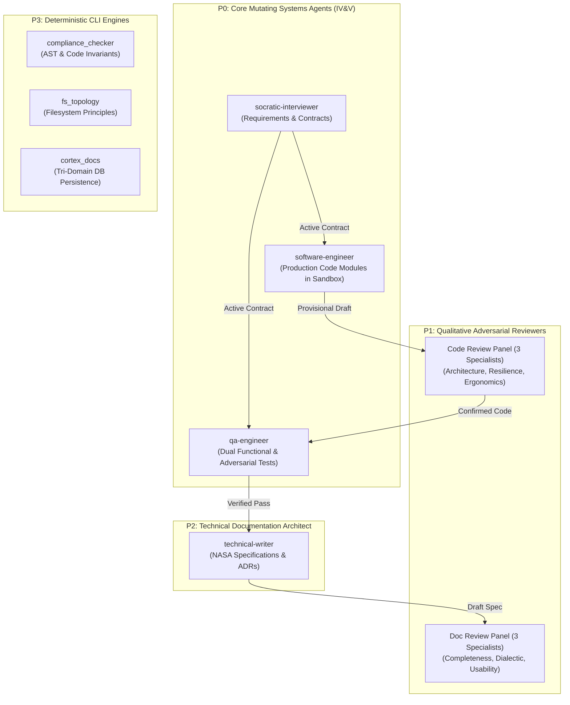
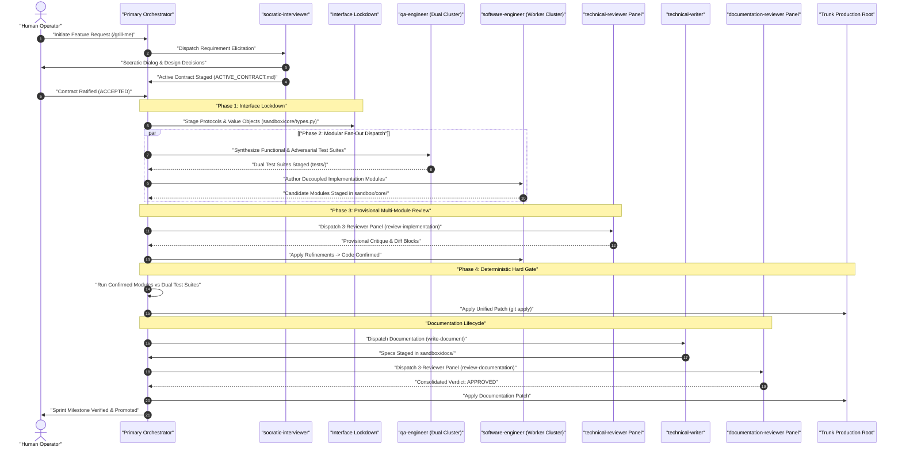

# Autonomous Agent Registry and Capability Matrix Specification (v2.1)

This specification establishes the authoritative Single Source of Truth (SSOT) catalog, capability
matrix, security boundaries, and lifecycle orchestration topologies for all 10 specialized agent
personas in Project Autopoiesis.

---

## 1. Architectural Overview & Persona Taxonomy

Project Autopoiesis organizes autonomous agents into four functional tiers based on blast radius,
mutation privileges, and cognitive mandates:



### 1.1 Taxonomy Classification Definitions
1. **Tier P0 (Systems Builders, Elicitors & QA Verifiers)**:
   - Agents possessing scoped filesystem write privileges in `./sandbox/` or `docs/active/`.
   - Authorized for requirement elicitation (`socratic-interviewer`), production coding (`software-engineer`),
     and independent adversarial and functional test authoring (`qa-engineer`).
2. **Tier P1 (Adversarial Quality Reviewers)**:
   - Read-only agents executing qualitative code and documentation audits.
   - Enforce domain abstraction integrity, concurrency resilience, on-call ergonomics, and completeness.
3. **Tier P2 (Information Architects)**:
   - Specialized agents authoring NASA-grade technical documentation, ADRs, RFCs, and operational runbooks.
4. **Tier P3 (Deterministic CLI Utilities)**:
   - Purely deterministic, non-LLM Python CLI automation tools enforcing quantitative AST rules.

---

## 2. Complete Agent Capability & Security Matrix

The following contiguous matrix establishes the authoritative configuration, tool permissions,
watchdog timeout budgets, and dispatch skills for all 10 registered personas:

| Agent Identifier | Tier | Target Domain | Mutating Privilege | Watchdog Timeout | Declared Tool Bindings | Primary Dispatch Skill |
| :--- | :---: | :--- | :---: | :---: | :--- | :--- |
| **`software-engineer`** | P0 | Code / Systems | `Mutating (Sandbox)` | 600s | `view_file`, `write_to_file`, `replace_file_content`, `grep_search`, `find_by_name`, `run_command`, `send_message` | `implement` |
| **`qa-engineer`** | P0 | Code / QA & IV&V | `Mutating (Sandbox)` | 600s | `view_file`, `write_to_file`, `replace_file_content`, `grep_search`, `find_by_name`, `run_command`, `send_message` | `implement` |
| **`socratic-interviewer`** | P0 | Requirements / Contracts | `Mutating (Active)` | 900s | `view_file`, `grep_search`, `find_by_name`, `ask_question`, `write_to_file`, `run_command`, `send_message` | `grill-me` |
| **`technical-writer`** | P2 | Docs / Specifications | `Mutating (Sandbox)` | 600s | `view_file`, `write_to_file`, `replace_file_content`, `grep_search`, `find_by_name`, `run_command` | `write-document` |
| **`technical-reviewer-architecture`** | P1 | Code / Domain Design | `Read-Only` | 300s | `view_file`, `grep_search`, `send_message` | `review-implementation` |
| **`technical-reviewer-resilience`** | P1 | Code / Concurrency & I/O | `Read-Only` | 300s | `view_file`, `grep_search`, `send_message` | `review-implementation` |
| **`technical-reviewer-ergonomics`** | P1 | Code / Cognitive Load | `Read-Only` | 300s | `view_file`, `grep_search`, `send_message` | `review-implementation` |
| **`documentation-reviewer-completeness`** | P1 | Docs / Failure Modes | `Read-Only` | 300s | `view_file`, `grep_search`, `send_message` | `review-documentation` |
| **`documentation-reviewer-dialectic`** | P1 | Docs / Trade-off Honesty | `Read-Only` | 300s | `view_file`, `grep_search`, `send_message` | `review-documentation` |
| **`documentation-reviewer-usability`** | P1 | Docs / Operations & Ops | `Read-Only` | 300s | `view_file`, `grep_search`, `send_message` | `review-documentation` |

---

## 3. End-to-End Decoupled IV&V Orchestration Topology

Project Autopoiesis enforces an Independent Verification and Validation (IV&V) closed-loop lifecycle,
supporting both single-pair execution and Interface-Locked Modular Parallelism:



---

## 4. Deep-Dive Persona Profiles

### 4.1 `software-engineer` (Lead Systems Software Engineer)
- **Primary Mandate**: Implements minimal, production-grade source code satisfying contracts under IV&V.
- **Modular Parallel Mode**: Supports concurrent dispatch across decoupled modules bound by frozen `protocols.py`.
- **Confinement Invariant**: All new files and experimental code MUST reside inside `./sandbox/`.
- **Quality Mandate**: Enforces CC $\le 10$, nesting depth $\le 3$, and strict KISS/YAGNI principles.
- **Standalone Subprocess Invocation**:
  ```bash
  python -m core.agent_runner run --agent software-engineer --target sandbox/core/worker.py
  ```

### 4.2 `qa-engineer` (Lead Systems QA Engineer & Adversarial Verifier)
- **Primary Mandate**: Authors independent, contract-breaking unit and integration test suites.
- **Dual Synthesis Modes**:
  - **Functional QA**: Tests happy-path contracts, valid state transitions, and deterministic outputs.
  - **Adversarial QA**: Tests failure paths, timeout watchdogs, file lock contention, and bad input handling.
- **IV&V Invariant**: Operates independently from `software-engineer` directly from `ACTIVE_CONTRACT.md`.
- **Negative Ratio Mandate**: Maintains $\ge 40\%$ negative assertions evaluating edge cases and exceptions (`H-CODE-3`).
- **Standalone Subprocess Invocation**:
  ```bash
  python -m core.agent_runner run --agent qa-engineer --target sandbox/tests/test_worker.py
  ```

### 4.3 `socratic-interviewer` (Socratic Requirements Architect)
- **Primary Mandate**: Explores ambiguous problem domains through multi-turn interrogation, formulating binding contracts.
- **Fail-Closed Invariant**: Enforces `[INV-GRILL-07]` (Silence Is Not Consent); missing responses quarantine to `ON_HOLD`.
- **Target Artifact**: Authors `docs/active/ACTIVE_CONTRACT.md`.
- **Standalone Subprocess Invocation**:
  ```bash
  python -m core.agent_runner run --agent socratic-interviewer
  ```

### 4.4 `technical-writer` (Lead Technical Writer & Information Architect)
- **Primary Mandate**: Authors NASA-grade technical specifications, architectural blueprints, ADRs, and operational runbooks.
- **Normative Invariant**: Uses strict normative keywords (`SHALL`, `SHALL NOT`, `MUST`, `DO`, `DON'T`).
- **Quality Gate**: Clears `validate_doc_preapproval.py` with 0 defects before handoff.
- **Standalone Subprocess Invocation**:
  ```bash
  python -m core.agent_runner run --agent technical-writer --target docs/specs/NEW_SPEC.md
  ```

### 4.5 `technical-reviewer-architecture` (Domain Abstraction Reviewer)
- **Primary Mandate**: Audits domain abstraction honesty, value objects, ubiquitous language, and speculative over-engineering.
- **Panel Participation**: Member of `--type code` review panel.
- **Standalone Subprocess Invocation**:
  ```bash
  python -m core.agent_runner run --agent technical-reviewer-architecture --target core/fs_topology.py
  ```

### 4.6 `technical-reviewer-resilience` (Evolutionary Resilience Reviewer)
- **Primary Mandate**: Audits concurrency hazards, resource leaks, error containment, and unstated environmental assumptions.
- **Panel Participation**: Member of `--type code` review panel.
- **Standalone Subprocess Invocation**:
  ```bash
  python -m core.agent_runner run --agent technical-reviewer-resilience --target core/fs_topology.py
  ```

### 4.7 `technical-reviewer-ergonomics` (Cognitive Ergonomics Reviewer)
- **Primary Mandate**: Audits cognitive load, on-call comprehension, SLAP conformance, and nesting depth $\le 3$.
- **Panel Participation**: Member of `--type code` review panel.
- **Standalone Subprocess Invocation**:
  ```bash
  python -m core.agent_runner run --agent technical-reviewer-ergonomics --target core/fs_topology.py
  ```

### 4.8 `documentation-reviewer-completeness` (Specification Completeness Reviewer)
- **Primary Mandate**: Exposes unstated assumptions, missing failure states, rollback gaps, and security voids.
- **Panel Participation**: Member of `--type doc` review panel.
- **Standalone Subprocess Invocation**:
  ```bash
  python -m core.agent_runner run --agent documentation-reviewer-completeness --target docs/active/CURRENT_STATE.md
  ```

### 4.9 `documentation-reviewer-dialectic` (Dialectical Logic Reviewer)
- **Primary Mandate**: Audits logical integrity, self-rationalization, trade-off honesty, and causal validity.
- **Panel Participation**: Member of `--type doc` review panel.
- **Standalone Subprocess Invocation**:
  ```bash
  python -m core.agent_runner run --agent documentation-reviewer-dialectic --target docs/active/CURRENT_STATE.md
  ```

### 4.10 `documentation-reviewer-usability` (Operational Usability Reviewer)
- **Primary Mandate**: Audits operational actionability, command ambiguity, mistake-proofing, and high-stress runbook safety.
- **Panel Participation**: Member of `--type doc` review panel.
- **Standalone Subprocess Invocation**:
  ```bash
  python -m core.agent_runner run --agent documentation-reviewer-usability --target docs/active/CURRENT_STATE.md
  ```

---

## 5. Operational Invariants & Governance Directives

Technical directives and system invariants are defined below conforming to NASA SP-2016-6105 Rev 2.

### 5.1 Registration & Parity Directives
- **`[REQ-REG-01]` Zero-Drift Invariant**: Every markdown persona located in `.agents/agents/*.md`
  **SHALL** maintain a corresponding registered record in Section 2 of this specification.
- **`[REQ-REG-02]` Tool Privilege Ceiling**: Qualitative review personas **SHALL NOT** declare
  mutating filesystem tools (`write_to_file`, `replace_file_content`).
- **`[REQ-REG-03]` Fail-Closed Timeout Enforcement**: Out-of-process executions exceeding their
  declared timeout budget **SHALL** transition to `ON_HOLD` with exit code `2` per `[INV-GRILL-07]`.
- **`[REQ-REG-04]` Programmatic IPC Attestation**: Subagents dispatched via `invoke_subagent`
  **SHALL** transmit structured completion metrics to caller via `send_message` before concluding.
- **`[REQ-REG-05]` Production Confinement Mandate**: Autonomous mutating agents **SHALL NOT** apply
  modifications directly to the production root trunk (`.`) during active authoring.
- **`[REQ-REG-06]` IV&V Separation Mandate**: Test suites authored by `qa-engineer` **SHALL** be
  evaluated independently from implementations authored by `software-engineer`.
- **`[REQ-REG-07]` Interface-First Parallelism Mandate**: Modular multi-agent execution **SHALL** establish
  frozen type protocols in `types.py` or `protocols.py` prior to dispatching concurrent implementation workers.

### 5.2 Mandatory Engineering Actions
- **`DO`**: Verify all 10 personas using `python -m core.agent_runner list` prior to dispatching multi-agent workflows.
- **`DO`**: Freeze `protocols.py` before fan-out worker dispatch on Tier 3 modular tasks.
- **`DO`**: Execute `python scripts/compliance_checker.py docs/specs/AGENT_REGISTRY.md` upon any registry modification.
- **`DON'T`**: Merge candidate code to production without passing the independent QA test harness.
- **`DON'T`**: Allow implementation agents to author their own final acceptance test suites.
