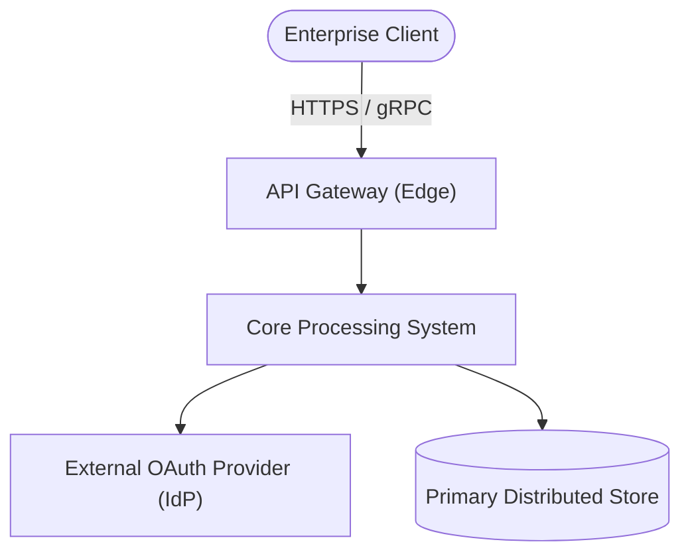
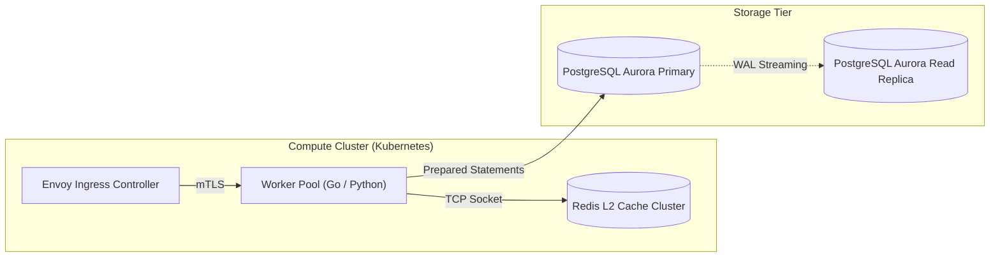

# Enterprise Technical Documentation Structural Specification (NASA & C4 Standards)

This specification establishes mandatory document schemas, provenance lifecycle tracking, architectural modeling standards, and verification matrices for all technical artifacts.

---

## 1. Document Lifecycle & Provenance Frontmatter

Every formal technical document MUST initiate with a standard YAML frontmatter block declaring its provenance and lifecycle state:

```yaml
---
id: "ADR-0042" # Canonical ID: ADR-xxxx, RFC-xxxx, OPS-xxxx, or INC-YYYY-MM-DD
title: "Distributed Consensus Engine Migration"
status: "PROPOSED" # Allowed: DRAFT | PROPOSED | ACCEPTED | SUPERSEDED | DEPRECATED
owner: "Platform Architecture Team"
last_reviewed: "2026-09-06"
supersedes: "ADR-0012" # Optional: ID of predecessor document replaced by this
dependencies: ["RFC-0089", "RFC-0104"]
---
```

> [!NOTE]
> ### Native Frontmatter Schema Exemption
> Agent definitions (`.agents/agents/*.md`) and Skill runbooks (`.agents/skills/**/SKILL.md`) SHALL use native Antigravity frontmatter schema (`name`, `description`, `subagent`, `tools`) instead of ADR headers.

### Lifecycle State Invariants
- **`DRAFT`**: Work in progress. Open to exploratory edits and architectural brainstorming.
- **`PROPOSED`**: Formally submitted for engineering review. Implementation MUST NOT proceed until promoted to `ACCEPTED`.
- **`ACCEPTED`**: Authoritative consensus reached. Active specification binding implementation.
- **`SUPERSEDED`**: Replaced by a newer document (MUST reference successor via `superseded_by`).
- **`DEPRECATED`**: Obsolete. Kept purely for forensic historical provenance.

---

## 2. Architectural Modeling: C4 Model via Mermaid

Architectural designs MUST NOT use informal box-and-arrow diagrams. All topology diagrams MUST adhere to the C4 Model hierarchy rendered via fenced `mermaid` blocks:

### A. Level 1: System Context Diagram
Defines the boundary of the system, users/actors, and external dependencies.



### B. Level 2: Container / Topology Diagram
Defines deployable units, inter-process protocols, data stores, and message brokers.



### C. Dynamic Diagram: Sequence or State Transition
Mandatory for distributed transactions, concurrent state machines, or asynchronous retry loops.

---

## 3. Non-Functional Requirements (NFR) Quantitative Matrix

All Architecture Blueprints and RFCs MUST include an explicit NFR Matrix defining concrete service levels, failure boundaries, and graceful degradation paths:

| Dimension | Target Metric (Nominal) | Degraded Boundary | Failure Mode & Fallback Strategy |
| :--- | :--- | :--- | :--- |
| **Throughput** | $\ge 5,000\text{ QPS}$ | $> 8,000\text{ QPS}$ | Shed load via HTTP 429 Too Many Requests |
| **P99 Latency** | $\le 20\text{ms}$ | $> 50\text{ms}$ | Fallback to stale read from local cache |
| **Availability** | $99.95\%$ uptime | $< 99.90\%$ | Failover to secondary availability zone (AZ) |
| **Durability / RPO** | $\text{RPO} = 0$ (Zero data loss) | N/A | Synchronous disk fsync via WAL before ACK |
| **Recovery / RTO** | $\text{RTO} < 30\text{s}$ | $> 60\text{s}$ | Automated leader election via Raft quorum |

---

## 4. NASA Verification Matrix (V-Matrix)

System requirements MUST be mapped to one of the four formal NASA verification methods:
1. **Test (T)**: Automated execution against test suites, benchmarks, or chaos tests.
2. **Analysis (A)**: Theoretical modeling, static analysis (AST/Flake8), or mathematical proofs.
3. **Inspection (I)**: Visual verification of source code, configuration files, or schemas.
4. **Demonstration (D)**: Live staging walkthrough of operational functionality.

### Standard V-Matrix Table
| Req ID | Requirement Statement | Method | Success Verification Criteria |
| :--- | :--- | :---: | :--- |
| `[REQ-01]` | Gateway **SHALL** rate-limit clients exceeding 100 req/sec. | **Test** | Load test verifies HTTP 429 emitted at 101st request. |
| `[REQ-02]` | Memory leak **SHALL NOT** exceed 1MB per 1M processed events. | **Analysis** | Heap memory profiling over 24-hour endurance run. |
| `[REQ-03]` | Encryption keys **SHALL NOT** reside in unencrypted config. | **Inspection** | Static secret scanning (AST/TruffleHog) passes with 0 hits. |

---

## 5. Production Schemas for 4 Canonical Archetypes

### Archetype 1: Architecture Decision Record (ADR)
Mandatory Sections:
1. **Frontmatter**: Canonical ID, title, status, owner, last_reviewed.
2. **Executive Summary**: 2-sentence summary of the decision.
3. **Context & Problem Statement**: Business driver and technical bottleneck.
4. **Considered Options & Comparative Matrix**: Compare at least 2 alternatives across Complexity, Operational Cost, Latency, and Velocity.
5. **Decision Outcome**: Selected alternative and justification.
6. **Consequences Matrix**: Positive (+), Negative (-), and Neutral (~) impacts.

### Archetype 2: RFC / System Blueprint
Mandatory Sections:
1. **Frontmatter & Goals / Non-Goals**: Clear declaration of what is out of scope.
2. **System Architecture**: C4 Context and Container diagrams.
3. **Data Contracts & Wire Protocols**: Exact JSON/Protobuf/SQL schemas.
4. **Normative Requirements**: Numbered `[REQ-xxx]` statements using `SHALL` and `SHALL NOT`.
5. **NFR Matrix & V-Matrix**: Quantitative targets and verification methods.
6. **Security & Threat Model**: STRIDE analysis, authorization boundaries.
7. **Phased Rollout & Rollback Strategy**: Feature flagging, dark launching, migration steps.

### Archetype 3: Operational Runbook (SEV Mitigation)
Mandatory Sections:
1. **Severity Classification**: Target SEV tier (SEV-1, SEV-2, SEV-3) and escalation SLA.
2. **Alert Triggers & Dashboards**: Metric alerts, log query links, triage dashboard.
3. **Immediate Triage & Containment**: Step 1-2 actions to stop user impact immediately.
4. **Step-by-Step Remediation**: Copy-pasteable CLI commands with expected outputs.
5. **Rollback Trigger & Script**: Explicit criteria for aborting and executing rollback.
6. **Post-Mitigation Verification**: Healthcheck commands confirming nominal state.

### Archetype 4: Blameless Postmortem (Incident RCA)
Mandatory Sections:
1. **Incident Summary & Impact**: Total downtime, affected users, financial/data cost.
2. **UTC Event Timeline**: Timestamped sequence of detection, triage, mitigation, resolution.
3. **5 Whys Root Cause Analysis**: Drilling down from physical defect to systemic cause.
4. **What Went Well / What Went Poorly / Where We Got Lucky**.
5. **Corrective Preventive Action Items**: Task table with owners, Jira IDs, and deadlines.
